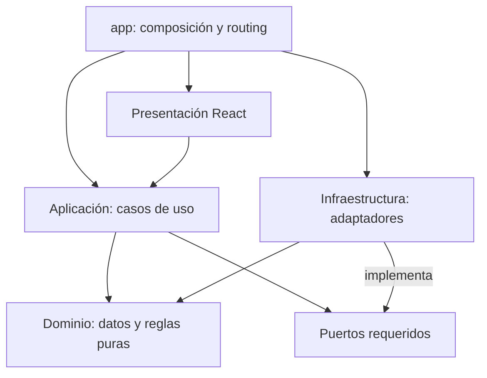

# Arquitectura técnica

## Propósito

Definir los límites de dominio y las reglas de dependencia para evolucionar el prototipo hacia una aplicación mantenible sin anticipar infraestructura ni capacidades POST-MVP. Esta arquitectura combina Screaming Architecture, Clean Architecture pragmática, programación funcional, KISS y DRY aplicado solo a conocimiento realmente compartido.

Este documento define dirección y límites. No implementa la estructura, no diseña Firestore y no convierte las posibilidades futuras en alcance aprobado.

## Principios

1. **El negocio organiza el código.** Los dominios y capacidades aparecen antes que las capas técnicas globales.
2. **Las reglas centrales son independientes.** El dominio no conoce React, Firebase, el navegador, transporte ni persistencia.
3. **Los efectos viven en los bordes.** Identidad, reloj, almacenamiento, red y navegación se introducen como dependencias explícitas.
4. **Los casos de uso son funciones.** Orquestan reglas y puertos mediante composición, sin clases de servicio, managers ni contenedores de inyección.
5. **La complejidad debe estar justificada.** Un feature solo incorpora las capas y abstracciones que necesita hoy.
6. **Los contratos pertenecen a quien los consume.** La aplicación define los puertos que necesita; infraestructura los implementa.
7. **DRY protege conocimiento, no formas parecidas.** Una abstracción compartida exige reutilización real y semántica estable.

## Dominios y capacidades actuales

### `game-sessions`

Es el dominio central del MVP. Representa y protege las reglas de una partida y de la participación asociada.

Responsabilidades:

- crear una partida con organizador, juego, fecha/hora, ciudad, zona, lugar cuando proceda y aforo;
- descubrir partidas disponibles y consultar su detalle;
- representar organizador y participantes confirmados mediante identificadores de jugador;
- solicitar participación y distinguir solicitud pendiente de plaza confirmada;
- aceptar o rechazar solicitudes;
- impedir superar el aforo y contar al organizador dentro de él;
- cerrar solicitudes que ya no puedan confirmarse cuando se ocupa la última plaza;
- representar los estados básicos necesarios de la partida y la participación;
- mantener diferenciados ciudad, zona/distrito, lugar y descripción.

`game-sessions` no posee el perfil de una persona. Conserva referencias mediante un `PlayerId` estable y obtiene la información pública necesaria a través de un contrato de aplicación. Como este identificador cruza `players`, `authentication`, `game-sessions` y futuras capacidades sin transportar datos del perfil, su representación puede vivir como primitiva mínima en `shared/domain`; `players` conserva la propiedad conceptual de la identidad de jugador. Tampoco se comparte la entidad `Player` ni sus reglas.

`game-sessions` tampoco conoce un catálogo externo de juegos: para el alcance actual basta una referencia de juego compatible con los datos simulados.

La política definitiva de visibilidad del lugar y el ciclo de vida ampliado de una partida permanecen abiertos.

### `players`

Es un dominio de apoyo responsable de la identidad de jugador dentro del producto, no de autenticar credenciales.

Responsabilidades:

- perfil de jugador;
- identificador interno de jugador;
- nombre visible, avatar y datos públicos aprobados;
- ciudad, zona/distrito y descripción del perfil cuando correspondan;
- consulta y actualización del perfil propio con las reglas de producto aplicables;
- lectura pública del perfil de otra persona según la futura política de privacidad.

Un `Player` responde a «quién es esta persona en Mesa Abierta». No representa una sesión de acceso, credenciales ni un `Firebase User`.

### `authentication`

Es una capacidad habilitadora con un límite explícito, no el modelo del jugador. Responde a «quién está autenticado» y proporciona a la aplicación una identidad autenticada mínima y agnóstica del proveedor.

La capa de aplicación resolverá esa identidad a un `PlayerId` antes de ejecutar acciones de negocio. Los claims, tokens y tipos de Firebase no entrarán en `players` ni en `game-sessions`. Firebase Authentication será una implementación futura del puerto de identidad.

No se define todavía proveedor, flujo de login, persistencia de sesión ni UI de autenticación.

### `app`

Es la raíz de composición. Configura routing, construye dependencias y conecta presentación, casos de uso y adaptadores. Puede conocer todas esas piezas para ensamblarlas, pero no contiene reglas de negocio ni se convierte en un servicio global.

### `shared`

Debe permanecer pequeño y explícito. Puede alojar:

- componentes puramente visuales utilizados realmente por más de un dominio;
- primitivas de dominio estables compartidas por al menos dos dominios;
- tipos técnicos transversales mínimos cuando su duplicación represente el mismo conocimiento.

`PlayerId` es una excepción compartida justificada porque identifica a la misma persona en varios dominios. No autoriza a trasladar perfiles, DTOs o reglas de `players` a `shared`.

No admite cajones genéricos llamados `utils`, `helpers`, `common`, servicios de negocio ni abstracciones creadas para un único consumidor. Por defecto, una pieza permanece dentro del dominio que la necesita.

## Recomendación sobre reputación

Reputación debe permanecer inicialmente integrada en `players` como información de confianza de solo lectura asociada al perfil. El prototipo solo necesita mostrar:

- reputación subjetiva: valoración y opiniones;
- fiabilidad observable o derivada: partidas, asistencias y ausencias sin aviso.

Crear ahora un dominio superior `reputation` obligaría a definir prematuramente elegibilidad, publicación, moderación, disputas, cálculo y persistencia. Se extraerá a un dominio propio si esas capacidades se aprueban y adquieren reglas, comandos, ciclo de vida o responsables independientes. La extracción deberá preservar un contrato de lectura compacto para `players` y `game-sessions`.

## Clean Architecture pragmática

Cada dominio puede crecer mediante cuatro responsabilidades conceptuales:

- **domain:** datos y reglas puras del negocio;
- **application:** casos de uso, coordinación y puertos requeridos;
- **infrastructure:** adaptadores de persistencia, autenticación, red o tiempo;
- **presentation:** páginas, componentes y adaptación del estado para React.

No todas deben existir como carpetas desde el primer día. Una carpeta se crea cuando contiene una responsabilidad real. Los componentes visuales simples pueden recibir datos y eventos directamente; no necesitan un caso de uso artificial. Las reglas de negocio sí deben salir de React y permanecer comprobables sin navegador.

Los contratos de persistencia se colocan junto al caso de uso consumidor en `application`, no en una capa global de repositories. Un adaptador en memoria y uno Firebase podrán cumplir el mismo puerto sin que el dominio conozca ninguno.

## Arquitectura de aplicación frontend

### Responsabilidades por capa

#### Domain

Contiene el conocimiento que debe seguir siendo correcto con independencia de la interfaz o la persistencia. En `game-sessions` incluye:

- cálculo de plazas disponibles;
- disponibilidad de una partida;
- condiciones para admitir una nueva solicitud;
- distinción entre solicitud pendiente y participación confirmada;
- aceptación o rechazo de solicitudes;
- transición a partida completa;
- cierre de solicitudes pendientes cuando se ocupa la última plaza;
- invariantes de aforo y pertenencia de quien organiza;
- transiciones básicas de participación.

Las reglas se expresan como funciones puras sobre datos inmutables. No formatean fechas para pantalla, no navegan, no muestran mensajes y no leen directamente reloj, navegador o almacenamiento. La validación de dominio debe repetirse aunque la presentación ya ofrezca validación inmediata.

#### Application

Representa intenciones completas del usuario o del sistema. Coordina dominio, identidad y puertos externos; establece el orden de lectura, validación y escritura; y traduce resultados esperables a una salida comprensible por la presentación.

En `game-sessions` está justificado disponer conceptualmente de:

- `discoverGameSessions`;
- `getGameSession`;
- `createGameSession`;
- `requestParticipation`;
- `acceptParticipationRequest`;
- `rejectParticipationRequest`.

No se fijan todavía sus firmas ni se exige un archivo por nombre. Un caso de uso merece existir cuando representa una intención de producto, aplica reglas, cruza un límite de efectos, coordina más de una dependencia o necesita probarse fuera de React. Un setter visual, la apertura de un panel, el texto de un filtro o una transformación local sin regla de negocio deben permanecer en presentación.

Las consultas también pueden ser casos de uso cuando aplican criterios de disponibilidad, autorización o acceso a persistencia. No necesitan una función ceremonial si son una lectura local temporal sin esas responsabilidades.

#### Presentation

React se organiza dentro de cada feature mediante responsabilidades, sin obligar a crear carpetas vacías:

- **pages:** conectan rutas con casos de uso, estados de carga/error/éxito y composición de pantalla;
- **components:** presentan datos y emiten eventos; los componentes visuales simples no conocen puertos ni casos de uso;
- **hooks de feature:** adaptan casos de uso y estado asíncrono al ciclo de React cuando existe reutilización o complejidad real.

Los hooks no constituyen una capa de negocio paralela. No deciden aforo, elegibilidad ni transiciones; tampoco importan Firebase. El estado puramente visual —campos en edición, pestaña seleccionada, apertura de un control o confirmación local— permanece junto al componente que lo utiliza.

#### Infrastructure

Implementa efectos y contratos definidos por Application: almacenamiento en memoria, Firebase, autenticación, reloj o generación de identificadores. Traduce datos externos a tipos internos y errores técnicos a resultados que Application pueda manejar.

No contiene decisiones de producto. Que un adaptador Firebase pueda ejecutar una operación no significa que esa operación esté autorizada; las reglas del dominio y la futura autorización de servidor deben seguir aplicándose.

### Estrategia inicial de estado

Se adopta la siguiente prioridad:

1. **Estado local de React** para formularios, filtros, controles abiertos, selecciones visuales y mensajes efímeros.
2. **Hooks de feature** para coordinar un caso de uso con loading, error y resultado cuando esa coordinación se repita o complique una page.
3. **Context limitado y compuesto desde `app`** solo para identidad y estado en memoria que deba sobrevivir entre rutas durante la migración del prototipo.

El `PrototypeContext` actual puede funcionar temporalmente como fachada de compatibilidad, pero no será el modelo de dominio ni el repositorio definitivo. No se introducirá Redux, Zustand, React Query ni otra librería hasta demostrar una necesidad que React y la composición actual no resuelvan.

Se distinguen tres clases de estado:

- **persistente o de servidor:** futuras partidas, perfiles y solicitudes guardadas; su fuente de verdad estará tras puertos de Application, no en Context;
- **de aplicación:** identidad actual, resultado de casos de uso y coordinación compartida entre rutas;
- **de UI:** valores temporales necesarios solo para render e interacción.

La estrategia futura de caché, sincronización, invalidación y actualizaciones optimistas se decidirá cuando exista persistencia real y evidencia de sus necesidades.

### Inyección explícita de dependencias

Los casos de uso serán funciones construidas con un objeto pequeño de dependencias nombradas. `app` creará los adaptadores una vez, construirá las funciones de aplicación y las ofrecerá a la presentación mediante props, hooks o providers estrechos.

Este patrón permite sustituir un adaptador en memoria por Firebase y usar fakes en pruebas sin contenedor de DI. No se usarán service locators, imports globales mutables, singletons, managers ni clases cuyo único propósito sea envolver funciones.

Una dependencia se inyecta cuando representa un efecto o una capacidad sustituible relevante: repositorio, identidad autenticada, reloj o generador de identificadores. Las funciones puras locales no requieren interfaces ni inyección.

### Ports y contracts

El consumidor define el contrato mínimo que necesita. Por ejemplo, si los casos de uso de `game-sessions` requieren persistencia, `GameSessionRepository` vivirá en `game-sessions/application`, cerca de esos casos de uso:

- **propietario:** Application de `game-sessions`;
- **consumidores:** casos de uso de `game-sessions`;
- **implementadores:** adaptador en memoria durante la transición y adaptador Firebase en infraestructura posteriormente.

El contrato describe capacidades del producto, no operaciones de Firebase ni un espejo genérico de CRUD. Puede dividirse si lectura y escritura desarrollan necesidades realmente distintas, pero no se creará una interfaz para cada función por defecto.

Los puertos de autenticación pertenecen a `authentication/application`. Cuando otro feature necesite conocer al actor, dependerá de una identidad interna mínima o de un puerto público, nunca de `Firebase User`.

### Responsabilidad detallada de `app`

`app` contiene exclusivamente:

- bootstrap de la SPA;
- routing y layouts globales;
- construcción de adaptadores;
- composición de casos de uso;
- providers técnicos o de aplicación necesarios para exponer dependencias.

No contiene validación de partidas, reglas de participación, consultas de negocio ni un estado global que replique todas las entidades. La composición puede depender de capas concretas porque ese es precisamente su límite.

### Criterio adicional para `shared`

Que dos archivos del mismo feature usen una pieza no justifica moverla a `shared`; debe permanecer en ese feature. Solo se comparte cuando existen consumidores de dominios distintos y el significado es el mismo. Las primitivas visuales accesibles y estables son candidatas; las reglas, DTOs, validaciones o formateadores específicos de partidas o perfiles no lo son.

## Estrategia de testing

- **Domain:** pruebas unitarias de funciones puras y sus invariantes, con especial atención a límites de aforo, solicitudes duplicadas, última plaza y transiciones no permitidas.
- **Application:** pruebas de casos de uso con fakes pequeños de los puertos; deben comprobar resultados y efectos observables sin React ni Firebase.
- **Presentation:** pruebas solo para interacciones relevantes, estados visibles, accesibilidad y conexión correcta con casos de uso; evitar snapshots extensos de markup.
- **Infrastructure futura:** pruebas de integración y de contratos contra emuladores cuando Firebase se incorpore.

No se selecciona todavía framework de testing. La herramienta se elegirá cuando comience la implementación de pruebas y deba encajar con Vite, TypeScript y los emuladores.

## Plan incremental de migración

La migración se realizará por comportamientos completos y con el prototipo ejecutable en cada paso:

1. Caracterizar mediante pruebas las reglas actuales de aforo, disponibilidad y participación.
2. Extraer esas reglas a funciones puras de `game-sessions/domain`, conservando temporalmente las llamadas desde el contexto actual.
3. Introducir primero los casos de uso de mutación que concentran mayor riesgo: solicitar, aceptar, rechazar y crear partida.
4. Convertir `PrototypeContext` en una fachada temporal que invoque esos casos de uso, sin modificar de golpe todas las pages.
5. Incorporar los casos de uso de consulta cuando deban aplicar criterios de negocio o cruzar persistencia.
6. Definir los puertos mínimos consumidos por los casos de uso e implementar adaptadores en memoria sobre los datos simulados existentes.
7. Separar perfil de jugador e identidad autenticada, manteniendo la identidad simulada tras el puerto de `authentication`.
8. Adaptar cada page y hook de feature de forma incremental; retirar de React las reglas ya cubiertas por Domain/Application.
9. Simplificar o retirar la fachada global cuando los límites por feature puedan sostener los flujos entre rutas.
10. En una fase posterior, añadir adaptadores Firebase y sustituir la composición en memoria desde `app`, sin cambiar las reglas de dominio.

Cada paso debe tener un alcance revisable y no mezclar reorganización masiva, cambio visual e infraestructura real.

## Reglas de dependencia

- `presentation` puede depender de la API pública de `application` y de componentes de presentación realmente compartidos.
- `application` puede depender de su propio `domain` y de los puertos que define para identidad, persistencia, reloj u otros dominios.
- `domain` solo depende de lenguaje y tipos propios o de primitivas compartidas justificadas.
- `infrastructure` depende de los contratos de `application` y de los tipos de dominio necesarios para implementarlos.
- `app` es el único lugar autorizado para componer implementaciones concretas con casos de uso y presentación.
- Una presentación no importa infraestructura ni SDKs de Firebase.
- Un dominio no importa la presentación ni los detalles internos de otro dominio.
- La coordinación entre dominios se hace mediante una API pública de aplicación o un puerto estrecho; nunca mediante imports profundos a carpetas internas.
- Los tipos externos se traducen en el adaptador. `Firebase User`, snapshots, timestamps y documentos no cruzan hacia dominio.
- Las dependencias de tiempo y generación de identificadores son explícitas cuando afectan reglas o pruebas.
- No se permiten ciclos entre dominios.



Las flechas representan dependencias de código permitidas. El dominio no apunta a ninguna capa exterior.

## Enfoque funcional

- Las entidades y valores se representan como datos inmutables.
- Las reglas son funciones puras que reciben el estado y la información necesaria y devuelven un nuevo estado o un resultado explícito.
- Los casos de uso son funciones construidas con dependencias explícitas.
- Lecturas y escrituras asíncronas se confinan a puertos y adaptadores.
- Los errores esperables del negocio se representan como resultados controlados; las excepciones se reservan para fallos inesperados o de infraestructura.
- React conserva estado de interfaz y coordina interacciones, pero no decide aforo, elegibilidad o transiciones de participación.
- No se introducen clases base, herencia, singletons, service locators ni frameworks de inyección de dependencias.

## Estructura objetivo a medio plazo

El siguiente árbol expresa responsabilidades; no ordena crear carpetas vacías ni mover ahora el prototipo.

```text
src/
├── app/
│   ├── composition/
│   └── routing/
├── game-sessions/
│   ├── domain/
│   ├── application/
│   ├── presentation/
│   └── infrastructure/       # solo al existir adaptadores reales o en memoria
├── players/
│   ├── domain/
│   ├── application/
│   ├── presentation/
│   └── infrastructure/       # solo al existir adaptadores reales o en memoria
├── authentication/
│   ├── application/          # identidad autenticada y puerto
│   └── infrastructure/       # identidad simulada o proveedor futuro
└── shared/
    ├── domain/                   # solo primitivas realmente compartidas
    └── presentation/             # UI visual reutilizada
```

### Necesario en la primera evolución

- hacer explícitas las fronteras `game-sessions`, `players` y `authentication`;
- extraer de React las reglas de partidas y participación;
- expresar los flujos aprobados como funciones de aplicación;
- mantener la identidad simulada tras el puerto de autenticación;
- conservar la presentación existente dentro de sus dominios;
- componer dependencias desde `app`.

### Solo cuando exista la necesidad

- carpetas `infrastructure` con adaptadores Firebase en Fase 5;
- contratos adicionales para integraciones externas;
- extracción de `reputation`;
- nuevos dominios aprobados después del MVP.

Durante la transición, `mock-data` puede seguir sirviendo al prototipo. Su sustitución o reubicación se decidirá al implementar adaptadores; este documento no prescribe un movimiento inmediato.

## Extensibilidad sin modelado especulativo

Las capacidades futuras se incorporarían previsiblemente así, siempre tras una decisión de producto:

- **collections:** dominio propio si gestiona colecciones personales y su ciclo de vida; no forma parte de `players` salvo una lectura resumida.
- **trades:** dominio propio por sus estados, participantes y reglas de intercambio; podría consultar `collections` y `players` mediante contratos públicos.
- **game voting:** inicialmente podría ser una capacidad de `game-sessions` vinculada a una quedada. Solo se extraería si adquiere reglas y reutilización independientes.
- **groups/clubs:** dominio propio si existen membresía, roles y gestión; una partida podría referenciar un grupo anfitrión sin absorber sus reglas.
- **chat:** capacidad o dominio de comunicación separado; `game-sessions` aportaría contexto y permisos mediante contratos, pero no almacenaría mensajes.
- **monetization/subscriptions:** dominio propio de suscripciones y derechos de acceso. Los casos de uso premium consultarían un contrato de autorización comercial sin introducir billing en el dominio central ni cerrar el acceso a descubrimiento, participación y confianza esenciales.
- **multi-ciudad:** evolución de localización y descubrimiento en `game-sessions` y de preferencias en `players`; no requiere por sí sola un dominio nuevo.
- **notifications:** adaptación de entrega alrededor de eventos de aplicación; solo merecería dominio propio si incorpora preferencias y reglas sustantivas.

No se crean carpetas, entidades, APIs ni contratos para estas posibilidades en la arquitectura actual.

## Límite de integración con Firebase

Firebase se integrará exclusivamente como infraestructura detrás de los puertos definidos por Application. Domain, Application y Presentation no importarán el SDK ni expondrán `Firebase User`, snapshots, referencias, timestamps o códigos de error del proveedor.

La composición concreta se realizará desde `app`: inicializará la infraestructura, construirá adaptadores y los inyectará en los casos de uso. React solo consumirá esos casos de uso. Los adaptadores previstos son conceptualmente:

- persistencia Firestore para partidas y participación;
- persistencia Firestore para perfiles de jugador;
- adaptación de Firebase Authentication a una identidad autenticada interna.

El núcleo del MVP podrá comenzar con Firebase Client SDK, Cloud Firestore, Security Rules y transacciones, sin backend propio. La aceptación de una solicitud deberá ser una operación atómica: Domain define la transición pura, Application aporta actor e intención, e Infrastructure ejecuta la lectura y escritura transaccional sin reinventar la regla. El resultado debe volver a comprobar aforo y estado, confirmar a una sola persona y cerrar cualquier solicitud que ya no pueda obtener plaza. El modelo de persistencia de Fase 5 deberá hacer posible esa garantía.

La información pública de una partida y los detalles restringidos del encuentro no deben compartir necesariamente la misma unidad legible. Firestore no aplica ocultación de campos en una lectura autorizada: si el lugar exacto tiene una audiencia menor, deberá existir una separación de persistencia o proyección que permita reglas distintas.

Security Rules se diseñarán y probarán como parte del adaptador, con denegación por defecto, mínimo privilegio y validación de las transiciones autorizadas. Las invariantes de seguridad que también existan en Domain deberán expresarse de nuevo en Rules porque operan en otro límite de confianza; esta duplicación es deliberada y no sustituye la regla pura. Auth y Firestore Emulator, junto con pruebas de reglas, serán obligatorios para el desarrollo local antes de conectar entornos remotos.

Los detalles completos se recogen en `FIREBASE_ARCHITECTURE.md` y en ADR-003.

## Decisiones pendientes

- esquema de Cloud Firestore, colecciones, documentos, consultas e índices;
- Security Rules completas y autorización detallada para el esquema definitivo;
- proveedor y flujo de autenticación;
- estrategia de caché, sincronización e invalidación para el futuro estado persistente;
- límites definitivos de los providers y retirada del `PrototypeContext` temporal;
- contratos detallados de casos de uso y persistencia;
- forma concreta de representar resultados y errores asíncronos;
- framework y configuración de testing;
- concurrencia y atomicidad para aforo y solicitudes;
- ciclo de vida ampliado: editar, cancelar, abandonar o retirar solicitudes;
- política de privacidad y momento de revelar el lugar exacto;
- algoritmo, elegibilidad, moderación y persistencia de reputación;
- proveedor de billing y diseño definitivo de monetización;
- catálogo externo de juegos, si llega a ser necesario.
