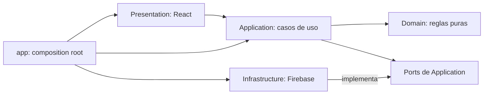
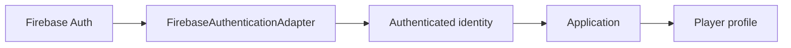

# Arquitectura de integración con Firebase

## Propósito y alcance

Definir cómo Firebase aporta autenticación, persistencia y hosting sin convertirse en una dependencia de Domain, Application o Presentation. Este documento establece fronteras y garantías, recoge la base local y las capacidades ya implementadas, y evita convertir el esquema Firestore actual en un diseño especulativo para capacidades futuras.

Stack previsto:

- Firebase Authentication;
- Cloud Firestore;
- Firebase Hosting;
- Firebase Emulator Suite;
- Cloud Storage solo cuando exista un archivo necesario para un caso de uso aprobado.

## Base local implementada

La Fase 5 incorpora una base local sin datos ni funcionalidades Firebase:

- `firebase.json` configura Auth Emulator en `127.0.0.1:9099` y Firestore Emulator en `127.0.0.1:8080`;
- `.firebaserc` usa exclusivamente `demo-mesa-abierta`, un project ID local que no representa ningún proyecto de producción;
- `src/app/composition/firebase.ts` inicializa Firebase desde el composition root y, solo en desarrollo, conecta los SDKs a los emuladores;
- el proyecto puede sobreescribir la configuración mediante variables `VITE_FIREBASE_*` locales, que permanecen ignoradas por Git;
- Firestore Emulator requiere un JDK local compatible; la base se ha validado con Temurin 21 y `java` debe estar disponible en `PATH` al abrir una nueva terminal;
- esta fundación no introdujo por sí misma flujos de producto; las iteraciones posteriores incorporaron autenticación, perfiles, partidas y solicitudes persistidas sobre la misma frontera.

El script `npm run emulators` inicia únicamente Auth y Firestore locales. No configura Hosting remoto, Storage ni Cloud Functions.

## Autenticación local implementada

La primera integración funcional utiliza exclusivamente email/password contra Auth Emulator. `FirebaseAuthenticationAdapter` vive en `authentication/infrastructure` y traduce `Firebase User` a `AuthenticatedUser`, con solo `id` y `email`; los tipos, códigos y objetos del SDK no cruzan ese límite.

`authentication/application` define el puerto y las operaciones de registro, inicio de sesión, cierre y observación de sesión. `AuthenticationProvider` consume ese puerto en React, espera la primera resolución antes de decidir la ruta y protege la SPA hasta que haya una identidad autenticada. Los errores del proveedor se traducen a un vocabulario de aplicación y a mensajes propios en la interfaz.

El puente inicial hacia un `Player` simulado se ha sustituido por `players/{uid}` persistido. Cada `AuthenticatedUser` resuelve su propio perfil antes de mostrar la SPA; la identidad de Auth y el tipo `Player` siguen siendo modelos distintos, aunque el MVP use el mismo valor estable de `uid` para vincularlos.

Firebase Auth mantiene su sesión local de navegador; por eso una recarga restaura la identidad cuando Auth Emulator sigue disponible. Google continúa fuera del MVP actual; Firestore cubre ya los perfiles, las partidas y las solicitudes aprobadas.

## Acceso cerrado al entorno DEV

El modo cloud DEV incorpora un guard previo a la carga del `Player`. Tras restaurar una identidad de Firebase Auth, la aplicación consulta exclusivamente `betaTesters/{uid}` mediante un port de Application y un adaptador Firestore de Infrastructure. Solo `{ active: true }` autoriza el montaje de `CurrentPlayerProvider` y, por tanto, la carga de perfiles y del resto de datos privados.

Una identidad autenticada sin documento activo recibe la pantalla «Beta cerrada» y solo puede cerrar sesión. Un fallo de infraestructura se mantiene separado de una denegación y permite reintentar o cerrar sesión. El cliente únicamente puede leer su propio estado; no puede listar, crear, actualizar ni borrar testers. La provisión de Auth y de `betaTesters/{uid}` corresponde a una operación administrativa confiable fuera de la SPA.

La política se activa solo con el modo Vite `cloud`, el proyecto `mesa-abierta-dev` y los emuladores deshabilitados. En desarrollo local el guard permanece inactivo y el registro continúa disponible. `npm run emulators` genera en `.firebase/` una variante local de la misma baseline cuya única diferencia es sustituir la comprobación de invitación por autenticación; `firebase.local.json` la usa sin duplicar las Rules. La suite de seguridad continúa probando `firestore.rules`, que es la baseline cloud cerrada.

En cloud DEV se oculta el enlace de alta y `/register` redirige a Login. No se usan invite codes, Cloud Functions, Admin SDK en frontend, Blaze ni Storage cloud. Estas Rules quedan preparadas y probadas localmente, pero no se despliegan en PROMPT-009B-1.

## Persistencia inicial de Player

`players/application` define un port reducido para obtener y crear un perfil. `FirestorePlayerRepository`, en Infrastructure, guarda únicamente `players/{uid}` y traduce su documento al modelo interno `Player`. El `uid` se usa como asociación estable autorizada, sin exponer `Firebase User` fuera de Infrastructure ni convertir Authentication en Player.

Tras autenticarse, la aplicación busca el perfil propio. Si no existe, muestra una pantalla mínima para crear nombre visible, Madrid fijo, distrito y descripción opcionales. Hasta que Auth y Player se resuelven no se muestra la SPA. La reputación, partidas, solicitudes y perfiles ajenos siguen siendo datos simulados.

`firestore.rules` aplica la baseline de seguridad del MVP actual: cualquier persona autenticada puede obtener por identificador los perfiles públicos necesarios para la SPA, sin permitir un listado general, y solo `uid` puede crear o actualizar su propio `players/{uid}`. La regla valida una lista cerrada de campos públicos, sus tipos y límites, e impide crear, modificar o ampliar el perfil de otra persona.

## Persistencia inicial de partidas

`game-sessions/application` define las consultas y el comando mínimos para descubrir, obtener, crear y recuperar las partidas organizadas. El adaptador Firestore persiste `gameSessions` con juego, `startsAt`, Madrid, distrito, lugar opcional, descripción opcional, aforo, organizador, participantes confirmados y estado; los tipos Firebase no cruzan Infrastructure. `date` y `time` se conservan temporalmente como compatibilidad derivada mientras se completa la migración local.

Las consultas actuales cargan las partidas persistidas para Explorar, Detalle y Mis partidas; Crear escribe una partida cuyo organizador ocupa la primera plaza conceptual. Las Rules permiten lectura solo autenticada, validan la forma mínima del documento y reservan creación, edición y cancelación al organizador identificado por Auth. `organizerId` es inmutable, el aforo nunca puede ser inferior a participantes confirmados y el borrado físico está denegado.

## Persistencia de solicitudes de participación

`ParticipationRequestRepository`, definido en `game-sessions/application`, persiste documentos mínimos en `participationRequests`: identificador, partida, jugador, estado (`pending`, `confirmed` o `rejected`) y fecha de creación. La interfaz consulta solicitudes propias y, para quien organiza, las pendientes de su partida; ya no existe un puente mock para estos estados.

El adaptador Firestore crea una solicitud con un identificador determinista por partida y jugador, de modo que no puede haber dos solicitudes de la misma persona para una misma partida. La aceptación y el rechazo son transacciones: revalidan organizador, solicitud pendiente y aforo autoritativo antes de escribir. La aceptación añade el jugador a `participantIds`; si ocupa la última plaza, cierra en esa misma transacción las solicitudes pendientes restantes como `rejected` y vacía la lista técnica mínima de referencias pendientes de la partida. La presentación traduce este último caso a “la partida se ha completado”, sin implicar un rechazo personal.

Las Rules permiten crear una solicitud `pending` solo para la identidad autenticada, con identificador determinista y dentro de una escritura coordinada con una partida abierta y con plaza. La lectura queda limitada al solicitante y al organizador; solo el organizador puede confirmar o rechazar. Las transiciones se validan contra el estado posterior de la partida para impedir autoconfirmaciones, participantes arbitrarios y aforo superior a `capacity`.

## Hora local y ciclo de vida esencial

`startsAt` es la autoridad temporal y se persiste como `Timestamp`. Infrastructure interpreta la fecha y hora civiles introducidas en `Europe/Madrid` y Presentation vuelve a derivar desde ese instante la fecha y hora visibles en Madrid. Así, 16:00 se mantiene como 16:00 tanto en invierno como en verano sin tratar la entrada como UTC ni aplicar compensaciones fijas.

Las horas inexistentes durante el cambio DST de primavera se rechazan con validación comprensible; las horas ambiguas de otoño usan de forma explícita la primera ocurrencia. `npm run migrate:session-starts-at` convierte documentos legacy de forma idempotente en Emulator, omite los ya migrados, no altera participantes, solicitudes, ownership ni otros datos y emite un recuento de migradas, omitidas y errores.

El puerto de partidas añade actualización y cancelación mínima. Solo la persona organizadora puede actualizar juego, fecha, hora, distrito, lugar, descripción y aforo; la operación transaccional conserva participantes y solicitudes, exige fecha/hora futura y no permite un aforo inferior a participantes confirmados. La cancelación es una transición a `cancelled`, nunca un borrado físico: cierra las solicitudes pendientes en la misma transacción, excluye la partida de Explorar y conserva el historial de Mis partidas.

Las Rules reflejan estas transiciones para el MVP implementado: una cancelación solo puede ejecutarla el organizador, debe conservar el documento y vaciar sus referencias pendientes; una partida cancelada no admite nuevas solicitudes ni confirmaciones. Esta baseline no cubre funcionalidades futuras todavía inexistentes y deberá revisarse antes de cualquier despliegue remoto.

## Baseline de Security Rules validada

`firestore.rules` sustituye las reglas temporales de las iteraciones anteriores y aplica `deny by default`, autenticación obligatoria, listas cerradas de campos, propiedad por identidad y transiciones mínimas compatibles con el modelo real. No existe acceso anónimo ni borrado de partidas o solicitudes desde cliente.

Las operaciones que cambian a la vez una partida y sus solicitudes se mantienen atómicas en Infrastructure. Las Rules usan el estado anterior y `getAfter()` como límite de confianza independiente: una solicitud nueva debe quedar enlazada a la partida, y una resolución solo es válida si su efecto sobre participantes y referencias pendientes es coherente con el aforo.

La batería `tests/firestore.rules.test.mjs`, ejecutada con `npm run test:rules`, usa Firebase Emulator y `@firebase/rules-unit-testing`. Cubre identidades sin autenticar, propietario, solicitante, organizador y terceros, con escenarios `ALLOW` y `DENY` para perfiles, partidas, solicitudes, cancelación y última plaza.

El modelo actual conserva una lista desnormalizada de identificadores pendientes en la partida. La transacción de Infrastructure cierra todos los documentos afectados al llenar o cancelar; las Rules impiden nuevas confirmaciones después de esos estados, pero no pueden cuantificar dinámicamente todos los documentos enlazados para exigir su actualización individual. Esta consistencia deberá vigilarse y reevaluarse si crece el volumen o cambia la representación.

## Frontera Firebase y aplicación

## Game Listings: persistencia local (PROMPT-007D)

`game-listings` persiste anuncios en `gameListings/{listingId}` e intereses y handoffs en las subcolecciones `interests/{playerId}` y `contactHandoffs/{playerId}`. Los adaptadores Firestore convierten `Timestamp` a ISO antes de cruzar hacia Application.

La portada se sube al Storage Emulator en `game-listings/{ownerId}/{listingId}/cover`; Firestore conserva solo `imageUrl`. Presentation transforma el archivo elegido en bytes y tipo MIME permitido; Domain no recibe `File`, `Blob`, referencias Storage ni tipos Firebase. Auth, Firestore y Storage usan `demo-mesa-abierta` localmente.

La baseline de 007E aplica forma cerrada, ownership, estados terminales y audiencia mínima a estas rutas. Los anuncios activos son visibles para usuarios autenticados; los cerrados solo para su propietario o una persona con interés previo. Intereses y handoffs mantienen lectura privada, y únicamente el propietario puede resolver un interés o compartir contacto cuando el interés está aceptado.

Las portadas quedan limitadas a `game-listings/{ownerId}/{listingId}/cover`: lectura autenticada y escritura, sustitución o borrado solo por el propietario, con JPEG/PNG/WebP y un máximo de 5 MB. La suite aislada de Rules usa los puertos `8180` y `9299`, un proyecto `demo-*` independiente y finaliza sus emuladores al terminar, para no tocar los datos locales de desarrollo.

Firestore y Storage no comparten una transacción ni contexto de Rules. Por ello, Storage protege identidad, ruta, tipo y tamaño, mientras Application/Infrastructure coordinan la creación del anuncio y la limpieza de una portada si falla Firestore. La existencia del anuncio, el contenido real del archivo más allá del MIME declarado y la eliminación de objetos huérfanos requieren controles operativos adicionales si el producto se despliega.

Se mantiene la dirección:



Reglas de frontera:

- Firebase SDK solo aparece en Infrastructure y en el bootstrap cuando sea imprescindible inicializarlo.
- Presentation no consulta Firestore ni Authentication directamente.
- Application conoce capacidades mediante puertos propios, no mediante SDKs.
- Domain no conoce Firebase, documentos, colecciones, red ni persistencia.
- Infrastructure traduce entre representaciones de Firebase y datos internos.
- `app` selecciona e inyecta los adaptadores; no contiene reglas de negocio.
- Hosting despliega la SPA, pero no modifica los límites de código.

## Authentication y Player

Firebase Authentication representa una identidad técnica: prueba que existe una sesión autenticada y aporta un identificador del proveedor. `Player` representa a una persona dentro de Mesa Abierta y contiene su perfil y datos públicos aprobados.

Son conceptos relacionados, pero no el mismo modelo. Aunque se decidiera reutilizar el valor de `uid` como identificador persistido por simplicidad, los tipos y responsabilidades seguirían separados.

Flujo conceptual:



Application recibirá una identidad autenticada mínima y resolverá el perfil interno necesario antes de ejecutar acciones. Los tokens, providers y claims de Firebase no cruzarán el adaptador.

Para el MVP futuro se contemplan email/password y Google como alternativas iniciales. La selección definitiva, el alta del primer perfil y la vinculación entre identidad técnica y `PlayerId` permanecen pendientes. No se diseña todavía la UI de acceso.

## Persistencia conceptual en Firestore

### Players

Pertenece al dominio `players`:

- perfil público aprobado;
- relación con la identidad autenticada;
- señales de confianza cuando lleguen a ser productivas.

Una persona autenticada podrá crear su perfil y modificar solo los campos propios permitidos. La lectura pública se limitará a la proyección necesaria para identificar a organizadores y participantes. Datos de cuenta, controles internos o información privada no se mezclarán con esa proyección por comodidad.

### Game sessions

Pertenece a `game-sessions`:

- datos publicados de la partida;
- organizador;
- aforo y estado;
- referencias a participantes confirmados;
- localización pública aproximada;
- relación con solicitudes de participación.

Una persona autenticada crea una partida como organizadora. Solo quien organiza podrá modificar los aspectos bajo su control, y siempre dentro de las transiciones permitidas. Los reglas no deben permitir cambiar arbitrariamente el organizador, superar el aforo o reescribir participantes.

### Participation requests

Forman parte del dominio `game-sessions`, aunque su representación física pueda quedar separada del documento principal:

- el solicitante crea una solicitud exclusivamente para sí mismo;
- el organizador acepta o rechaza;
- el solicitante no puede autoconfirmarse;
- una aceptación que complete el aforo cierra las solicitudes restantes que ya no puedan confirmarse;
- la lectura se limita al solicitante, al organizador y a cualquier rol adicional que se apruebe expresamente.

No se decide todavía si estos datos serán documentos independientes, subcolecciones o parte de otra representación. La elección deberá satisfacer consultas, atomicidad y reglas sin duplicar una fuente de verdad inconsistente.

## Persistencia de Game Listings

La Fase 6 implementa la siguiente estructura para `game-listings`:

```text
gameListings/{listingId}
├── interests/{playerId}
└── contactHandoffs/{playerId}
```

El anuncio conserva solo información publicable. Los intereses son relaciones privadas subordinadas y usan `playerId` como identificador para garantizar una sola relación por anuncio y persona. El medio de contacto aportado voluntariamente por el propietario se mantiene en una subcolección separada, legible únicamente por propietario y persona aceptada; nunca se deriva del email de Firebase Auth.

Firestore `Timestamp`, referencias y errores se traducen dentro de Infrastructure. Las consultas, índices, transiciones y límites de seguridad se detallan en `GAME_LISTINGS_ARCHITECTURE.md`; ADR-005 registra la decisión. La portada se mantiene en Storage bajo la ruta y política descritas en la sección de integración local.

## Necesidades de consulta

Los repositorios deberán cubrir las consultas del MVP sin exponer detalles de Firestore a Application.

### Explorar

- partidas futuras;
- no canceladas;
- con plazas disponibles;
- Madrid como contexto inicial;
- filtros por fecha, zona/distrito y juego;
- orden temporal.

La representación persistida deberá contener criterios consultables coherentes con la definición de disponibilidad. Las Security Rules no filtran resultados: la consulta del cliente debe ajustarse a las condiciones que las reglas permitan. Los índices concretos se decidirán después de fijar el esquema y medir las combinaciones necesarias.

### Mis partidas

- partidas organizadas por la identidad actual;
- participaciones confirmadas propias;
- solicitudes propias y su estado.

El repositorio puede resolverlo mediante más de una consulta y componer el resultado para Application. No se fuerza una única consulta ni una duplicación especulativa.

### Detalle

- partida;
- perfil público de quien organiza;
- participantes visibles;
- solicitudes pendientes solo para la audiencia autorizada;
- detalle sensible del encuentro solo si la futura política lo permite.

La composición de estos datos puede involucrar más de un repositorio. Un documento Firestore no debe crecer hasta absorber dominios ajenos solo para evitar consultas.

## Concurrencia y garantía de aforo

### Riesgo

Dos aceptaciones concurrentes, o una aceptación coincidente con otra operación sobre la partida, podrían observar la misma última plaza. Una comprobación previa en React no evita la carrera.

### Recomendación para el MVP

La aceptación de participación debe exponerse como una operación atómica del puerto de persistencia, no como varias llamadas CRUD independientes. La propiedad de responsabilidades queda así:

- Domain define y prueba la transición pura de participación y aforo;
- Application identifica al actor, coordina el caso de uso y solicita la operación atómica;
- Infrastructure abre la transacción, obtiene el estado autoritativo, aplica la transición de Domain y persiste su resultado;
- Security Rules validan de manera independiente que la escritura solicitada por el cliente respeta identidad, campos y restricciones críticas.

El adaptador Firestore utilizará una transacción para:

1. leer el estado autoritativo de la partida y la solicitud;
2. comprobar nuevamente organizador, estado y plazas disponibles;
3. confirmar a la persona una sola vez;
4. actualizar el aforo o la representación autoritativa de participantes;
5. marcar la partida como completa cuando corresponda;
6. cerrar dentro de la misma unidad atómica las solicitudes que ya no puedan obtener plaza.

La creación de una solicitud también deberá comprobar de forma consistente que la partida sigue abierta, tiene plaza y no contiene una solicitud o participación previa de esa persona. Firestore reintenta transacciones ante cambios concurrentes; el caso de uso debe poder devolver un resultado de conflicto o aforo completo sin filtrar errores del proveedor.

El esquema futuro debe permitir conocer y actualizar todos los registros afectados dentro de los límites transaccionales de Firestore. Si no puede garantizarse el cierre completo y verificable desde cliente y Rules con una representación sencilla, esta operación será candidata a una Cloud Function callable o backend confiable. No se introduce esa pieza preventivamente.

Security Rules actuarán como segunda barrera y validarán que una escritura no supera el aforo ni realiza una transición no autorizada. No sustituyen la transacción, y la transacción no sustituye las Rules.

Rules no puede reutilizar directamente las funciones TypeScript de Domain. Repetir en Rules las invariantes mínimas de seguridad es una duplicación intencionada entre dos límites de confianza, no una razón para trasladar las reglas de producto a Infrastructure.

## Principios de Security Rules

- Denegar por defecto todo acceso no autorizado explícitamente.
- Exigir autenticación para escrituras y para lecturas personales o restringidas.
- Aplicar mínimo privilegio por operación y por audiencia.
- Validar forma, campos permitidos y transiciones; no aceptar el documento completo porque proceda del cliente oficial.
- Permitir que una persona modifique solo los campos autorizados de su perfil.
- Permitir crear una solicitud solo para la identidad autenticada y una partida elegible.
- Impedir que un solicitante se confirme, cambie el aforo o modifique solicitudes ajenas.
- Reservar al organizador las decisiones de aceptar o rechazar, sin permitirle violar invariantes de aforo o propiedad.
- Evitar cambios arbitrarios de organizador, participantes y estados terminales.
- Separar lectura pública, lectura del participante y gestión del organizador.
- Denegar al cliente la escritura directa de ratings, agregados de reputación o señales de fiabilidad calculadas.
- Probar accesos permitidos y denegados con identidades distintas y sin autenticar.

Las reglas son parte versionada y probada de Infrastructure. La baseline actual cubre únicamente el esquema y las operaciones ya implementadas; cualquier capacidad nueva deberá ampliar reglas y pruebas antes de incorporarse.

## Client SDK frente a servidor propio

### Recomendación

El núcleo del MVP puede implementarse inicialmente con React, Firebase Client SDK, Firestore Security Rules y transacciones. Perfiles, partidas y solicitudes no necesitan por sí mismos un backend propio si las reglas pueden autorizar cada transición y el modelo permite garantizar el aforo atómicamente.

### Casos que podrían justificar operaciones confiables posteriores

- cálculo, agregación y protección de reputación real;
- comprobación de elegibilidad para publicar una review tras una partida confirmada y finalizada;
- tareas programadas o transiciones dependientes del tiempo;
- notificaciones y fan-out;
- moderación, prevención de abuso y auditoría con privilegios;
- webhooks de billing y cálculo de entitlements;
- cualquier operación multi-documento que no pueda protegerse de forma sencilla y verificable con transacciones y Rules.

Se evaluarán Cloud Functions o un backend solo cuando aparezca uno de estos requisitos. No se usarán para duplicar casos de uso del cliente sin una frontera de confianza necesaria.

## Privacidad del lugar

Ciudad y zona/distrito pueden formar parte de la información pública utilizada para descubrir una partida. Un nombre de lugar, instrucciones o una dirección exacta pueden requerir una audiencia más limitada.

Firestore Security Rules autorizan la lectura de documentos completos; no ocultan campos individuales después de conceder acceso. Por ello, si se aprueba mostrar detalles exactos solo a participantes confirmados u otra audiencia restringida, esos datos deberán persistirse en una unidad separada de la proyección pública de la partida. La regla podrá comprobar participación y estado antes de permitir la lectura.

No se decide todavía qué dato concreto se almacena, cuándo se revela, durante cuánto tiempo ni a qué roles. La arquitectura conserva esa posibilidad sin publicar ubicación precisa por defecto.

## Reputación y fiabilidad

PROMPT-008A extrae conceptualmente **`player-trust`** de `players` porque las reviews ya tienen reglas de elegibilidad, escritura, inmutabilidad y agregación propias. `players` podrá consumir un resumen de lectura, pero ni el propietario del perfil ni un cliente arbitrario podrán editarlo.

Una review solo será elegible si autor y persona valorada son Players distintos confirmados en la misma partida pasada y no cancelada, y no existe otra review en la misma dirección para esa sesión. La autorización no confiará en una afirmación enviada por el cliente.

PROMPT-008B concreta la arquitectura en `PLAYER_TRUST_ARCHITECTURE.md` y ADR-006:

- colección raíz conceptual `playerReviews/{reviewId}`;
- ID determinista mediante hash de sesión, autor y persona valorada;
- `participantIds` de Game Sessions como evidencia autoritativa de confirmación;
- `startsAt` Timestamp canónico y protegido como evidencia temporal;
- creación directa desde cliente únicamente cuando las Rules validen forma y elegibilidad;
- update/delete denegados desde cliente;
- media y recuento calculados al leer, sin agregados editables en Player.

No se necesita Cloud Function para este incremento si `startsAt` es canónico, las Rules protegen la evidencia y no se materializan agregados. Si esa precondición temporal no puede cumplirse, la creación deberá pasar a una operación server-side confiable. Attendance/no-show y moderación completa permanecen fuera.

PROMPT-008D implementa la colección raíz `playerReviews/{reviewId}` detrás de un port de Application. El runtime usa Firestore y el adaptador in-memory queda solo para tests. El identificador es SHA-256 lowercase de la tupla JSON canónica; una transacción crea el documento una sola vez y `createdAt` usa `serverTimestamp()`, compatible con `createdAt == request.time`.

Las consultas separan el agregado completo de la presentación paginada: el resumen calcula media y recuento desde todas las reviews recibidas, mientras el perfil muestra tres recientes y la vista completa pagina de 10 en 10 por `reviewedPlayerId`, `createdAt DESC` e ID. Firebase `Timestamp` se convierte a ISO dentro de Infrastructure.

PROMPT-008E convierte esas reglas provisionales en la baseline de seguridad de `playerReviews`: lectura autenticada; create con forma cerrada, identidad del autor, Players existentes y distintos, sesión pasada no cancelada, ambos participantes confirmados, rating entero 1..5, comentario opcional de hasta 500 caracteres, `createdAt == request.time` e ID SHA-256 lowercase del JSON canónico; update/delete quedan denegados.

`startsAt` es obligatorio y de tipo Timestamp en nuevas Game Sessions. El organizador solo puede cambiarlo antes del inicio y hacia otro instante futuro; una sesión iniciada no puede reprogramarse, aunque conserva la política existente de cancelación. Nuevas solicitudes y confirmaciones también se detienen al alcanzar `startsAt`, evitando fabricar `participantIds` retrospectivos para obtener elegibilidad de review. Las nuevas escrituras omiten `date/time`; si permanecen en documentos legacy, las Rules los validan como pareja y los mantienen inmutables, mientras toda lectura temporal usa `startsAt` como autoridad. La suite del Emulator prueba tanto operaciones permitidas como los principales vectores de denegación sin relajar las reglas anteriores.

## Monetización

Firebase no introducirá planes, precios o entitlements en `players` ni en `game-sessions`. Una futura capacidad `subscriptions/entitlements` permanecerá separada y expondrá a Application solo la autorización comercial mínima que necesite cada caso de uso.

La verificación de pagos o webhooks requeriría una operación de servidor confiable, pero proveedor, billing y precios no se diseñan en esta fase.

## Adaptadores previstos

Los nombres son orientativos y no implican clases:

- `FirestoreGameSessionRepository` para persistencia y consultas de partidas y participación;
- `FirestorePlayerRepository` para perfiles y sus proyecciones autorizadas;
- `FirebaseAuthenticationAdapter` para convertir el estado de Auth en identidad autenticada interna.

Se prefieren factories o funciones que cierren sobre las instancias del SDK y devuelvan las operaciones exigidas por cada port. Un adaptador puede dividirse si lectura y comandos transaccionales desarrollan responsabilidades claramente distintas. No se creará una interfaz o wrapper por cada llamada al SDK.

## Traducción de errores

Infrastructure traducirá errores esperables de Firebase a un vocabulario pequeño de la aplicación, por ejemplo:

- autenticación requerida;
- permiso denegado;
- recurso no encontrado;
- conflicto o estado concurrente;
- servicio no disponible.

Los resultados propios del negocio, como partida completa o solicitud ya existente, deben provenir de Domain/Application aunque una carrera los revele durante una transacción. Presentation recibirá resultados comprensibles y nunca dependerá de cadenas como `permission-denied` o de excepciones específicas del SDK.

No se diseña una jerarquía compleja de errores. Infrastructure puede conservar la causa técnica para diagnóstico seguro sin mostrarla al usuario ni filtrar datos sensibles.

## Emulator Suite

El desarrollo local y la integración automatizada usarán Emulator Suite como requisito:

- Auth Emulator para identidades y sesiones de prueba;
- Firestore Emulator para persistencia y transacciones;
- pruebas de Security Rules con contextos sin autenticar, propietarios, solicitantes, participantes y organizadores;
- datos semilla deterministas para reproducir aforo, concurrencia y denegaciones;
- conexión explícita a emuladores en desarrollo para evitar tocar producción por accidente.

Hosting Emulator podrá utilizarse para validar la entrega integrada de la SPA cuando aporte valor. Storage Emulator solo se incorporará si se aprueba un caso de uso con archivos.

Antes de conectar un entorno remoto deberán superarse pruebas de Rules para accesos permitidos y denegados, además de los escenarios concurrentes de la última plaza.

## Validación integrada local de Fase 5

La validación end-to-end contra Auth Emulator y Firestore Emulator cubre dos cuentas aisladas: creación y restauración de sesión, creación de `Player`, publicación y recarga de una partida, solicitud, aceptación, rechazo, edición de hora y cancelación. Las cuentas de prueba se vinculan a sus propios perfiles persistidos; la identidad activa no depende del antiguo perfil global simulado.

La revisión detectó una carrera visual al restaurar una ruta protegida: Auth ya podía estar autenticado mientras `Player` aún permanecía en estado `idle`, lo que provocaba una redirección transitoria a Explorar. La composición espera ahora ese estado antes de decidir la ruta, preservando detalle y solicitudes tras F5.

El prototipo recupera datos al volver a entrar o recargar. No implementa sincronización en tiempo real entre pestañas, notificaciones ni listeners en vivo; esa limitación no bloquea los flujos actuales y deberá reevaluarse cuando exista un requisito de actualización inmediata.

## Decisiones pendientes

- esquema de colecciones, documentos, relaciones y proyecciones;
- representación de solicitudes y participantes que permita atomicidad;
- consultas definitivas e índices requeridos;
- incorporación futura de Google u otros providers de Authentication;
- actualización del perfil propio y política de lectura pública de perfiles;
- coincidencia o separación material entre `uid` y `PlayerId`;
- campos públicos y privados definitivos del perfil;
- política exacta de visibilidad, revelación y retención del lugar;
- límites de transacciones y necesidad real de una operación server-side para aceptar la última plaza;
- ciclo de vida completo de partidas y solicitudes;
- implementación, índices y pruebas de Rules para `player-trust`; la elegibilidad y persistencia conceptual están definidas, mientras moderación completa sigue pendiente;
- estrategia de caché y sincronización del cliente;
- modelo de monetización, proveedor de billing y entitlements;
- necesidad futura de Storage.
