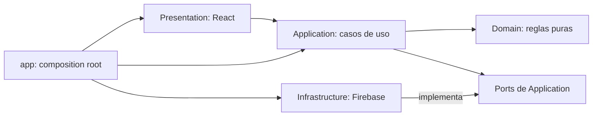
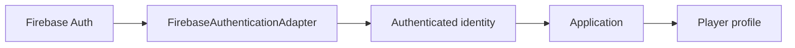

# Arquitectura de integración con Firebase

## Propósito y alcance

Definir cómo Firebase podrá aportar autenticación, persistencia y hosting sin convertirse en una dependencia de Domain, Application o Presentation. Este documento establece fronteras y garantías; no configura Firebase, no crea colecciones y no define un esquema Firestore campo por campo.

Stack previsto:

- Firebase Authentication;
- Cloud Firestore;
- Firebase Hosting;
- Firebase Emulator Suite;
- Cloud Storage solo cuando exista un archivo necesario para un caso de uso aprobado.

## Frontera Firebase y aplicación

Se mantiene la dirección:

Reglas de frontera:

- Firebase SDK solo aparece en Infrastructure y en el bootstrap cuando sea imprescindible inicializarlo.
- Presentation no consulta Firestore ni Authentication directamente.
- Application conoce capacidades mediante puertos propios, no mediante SDKs.
- Domain no conoce Firebase, documentos, colecciones, red ni persistencia.
- Infrastructure traduce entre representaciones de Firebase y datos internos.
- `app` selecciona e inyecta los adaptadores; no contiene reglas de negocio.
- Hosting despliega la SPA, pero no modifica los límites de código.

## Authentication y Player

Firebase Authentication representa una identidad técnica: prueba que existe una sesión autenticada y aporta un identificador del proveedor. `Player` representa a una persona dentro de Mesa Abierta y contiene su perfil y datos públicos aprobados.

Son conceptos relacionados, pero no el mismo modelo. Aunque se decidiera reutilizar el valor de `uid` como identificador persistido por simplicidad, los tipos y responsabilidades seguirían separados.

Flujo conceptual:

Application recibirá una identidad autenticada mínima y resolverá el perfil interno necesario antes de ejecutar acciones. Los tokens, providers y claims de Firebase no cruzarán el adaptador.

Para el MVP futuro se contemplan email/password y Google como alternativas iniciales. La selección definitiva, el alta del primer perfil y la vinculación entre identidad técnica y `PlayerId` permanecen pendientes. No se diseña todavía la UI de acceso.

## Persistencia conceptual en Firestore

### Players

Pertenece al dominio `players`:

- perfil público aprobado;
- relación con la identidad autenticada;
- señales de confianza cuando lleguen a ser productivas.

Una persona autenticada podrá crear su perfil y modificar solo los campos propios permitidos. La lectura pública se limitará a la proyección necesaria para identificar a organizadores y participantes. Datos de cuenta, controles internos o información privada no se mezclarán con esa proyección por comodidad.

### Game sessions

Pertenece a `game-sessions`:

- datos publicados de la partida;
- organizador;
- aforo y estado;
- referencias a participantes confirmados;
- localización pública aproximada;
- relación con solicitudes de participación.

Una persona autenticada crea una partida como organizadora. Solo quien organiza podrá modificar los aspectos bajo su control, y siempre dentro de las transiciones permitidas. Los reglas no deben permitir cambiar arbitrariamente el organizador, superar el aforo o reescribir participantes.

### Participation requests

Forman parte del dominio `game-sessions`, aunque su representación física pueda quedar separada del documento principal:

- el solicitante crea una solicitud exclusivamente para sí mismo;
- el organizador acepta o rechaza;
- el solicitante no puede autoconfirmarse;
- una aceptación que complete el aforo cierra las solicitudes restantes que ya no puedan confirmarse;
- la lectura se limita al solicitante, al organizador y a cualquier rol adicional que se apruebe expresamente.

No se decide todavía si estos datos serán documentos independientes, subcolecciones o parte de otra representación. La elección deberá satisfacer consultas, atomicidad y reglas sin duplicar una fuente de verdad inconsistente.

## Necesidades de consulta

Los repositorios deberán cubrir las consultas del MVP sin exponer detalles de Firestore a Application.

### Explorar

- partidas futuras;
- no canceladas;
- con plazas disponibles;
- Madrid como contexto inicial;
- filtros por fecha, zona/distrito y juego;
- orden temporal.

La representación persistida deberá contener criterios consultables coherentes con la definición de disponibilidad. Las Security Rules no filtran resultados: la consulta del cliente debe ajustarse a las condiciones que las reglas permitan. Los índices concretos se decidirán después de fijar el esquema y medir las combinaciones necesarias.

### Mis partidas

- partidas organizadas por la identidad actual;
- participaciones confirmadas propias;
- solicitudes propias y su estado.

El repositorio puede resolverlo mediante más de una consulta y componer el resultado para Application. No se fuerza una única consulta ni una duplicación especulativa.

### Detalle

- partida;
- perfil público de quien organiza;
- participantes visibles;
- solicitudes pendientes solo para la audiencia autorizada;
- detalle sensible del encuentro solo si la futura política lo permite.

La composición de estos datos puede involucrar más de un repositorio. Un documento Firestore no debe crecer hasta absorber dominios ajenos solo para evitar consultas.

## Concurrencia y garantía de aforo

### Riesgo

Dos aceptaciones concurrentes, o una aceptación coincidente con otra operación sobre la partida, podrían observar la misma última plaza. Una comprobación previa en React no evita la carrera.

### Recomendación para el MVP

La aceptación de participación debe exponerse como una operación atómica del puerto de persistencia, no como varias llamadas CRUD independientes. La propiedad de responsabilidades queda así:

- Domain define y prueba la transición pura de participación y aforo;
- Application identifica al actor, coordina el caso de uso y solicita la operación atómica;
- Infrastructure abre la transacción, obtiene el estado autoritativo, aplica la transición de Domain y persiste su resultado;
- Security Rules validan de manera independiente que la escritura solicitada por el cliente respeta identidad, campos y restricciones críticas.

El adaptador Firestore utilizará una transacción para:

1. leer el estado autoritativo de la partida y la solicitud;
2. comprobar nuevamente organizador, estado y plazas disponibles;
3. confirmar a la persona una sola vez;
4. actualizar el aforo o la representación autoritativa de participantes;
5. marcar la partida como completa cuando corresponda;
6. cerrar dentro de la misma unidad atómica las solicitudes que ya no puedan obtener plaza.

La creación de una solicitud también deberá comprobar de forma consistente que la partida sigue abierta, tiene plaza y no contiene una solicitud o participación previa de esa persona. Firestore reintenta transacciones ante cambios concurrentes; el caso de uso debe poder devolver un resultado de conflicto o aforo completo sin filtrar errores del proveedor.

El esquema futuro debe permitir conocer y actualizar todos los registros afectados dentro de los límites transaccionales de Firestore. Si no puede garantizarse el cierre completo y verificable desde cliente y Rules con una representación sencilla, esta operación será candidata a una Cloud Function callable o backend confiable. No se introduce esa pieza preventivamente.

Security Rules actuarán como segunda barrera y validarán que una escritura no supera el aforo ni realiza una transición no autorizada. No sustituyen la transacción, y la transacción no sustituye las Rules.

Rules no puede reutilizar directamente las funciones TypeScript de Domain. Repetir en Rules las invariantes mínimas de seguridad es una duplicación intencionada entre dos límites de confianza, no una razón para trasladar las reglas de producto a Infrastructure.

## Principios de Security Rules

- Denegar por defecto todo acceso no autorizado explícitamente.
- Exigir autenticación para escrituras y para lecturas personales o restringidas.
- Aplicar mínimo privilegio por operación y por audiencia.
- Validar forma, campos permitidos y transiciones; no aceptar el documento completo porque proceda del cliente oficial.
- Permitir que una persona modifique solo los campos autorizados de su perfil.
- Permitir crear una solicitud solo para la identidad autenticada y una partida elegible.
- Impedir que un solicitante se confirme, cambie el aforo o modifique solicitudes ajenas.
- Reservar al organizador las decisiones de aceptar o rechazar, sin permitirle violar invariantes de aforo o propiedad.
- Evitar cambios arbitrarios de organizador, participantes y estados terminales.
- Separar lectura pública, lectura del participante y gestión del organizador.
- Denegar al cliente la escritura directa de ratings, agregados de reputación o señales de fiabilidad calculadas.
- Probar accesos permitidos y denegados con identidades distintas y sin autenticar.

Las reglas son parte versionada y probada de Infrastructure. No se redactan completas hasta disponer del esquema y de las operaciones definitivas.

## Client SDK frente a servidor propio

### Recomendación

El núcleo del MVP puede implementarse inicialmente con React, Firebase Client SDK, Firestore Security Rules y transacciones. Perfiles, partidas y solicitudes no necesitan por sí mismos un backend propio si las reglas pueden autorizar cada transición y el modelo permite garantizar el aforo atómicamente.

### Casos que podrían justificar operaciones confiables posteriores

- cálculo, agregación y protección de reputación real;
- comprobación de elegibilidad para publicar una review tras una partida confirmada y finalizada;
- tareas programadas o transiciones dependientes del tiempo;
- notificaciones y fan-out;
- moderación, prevención de abuso y auditoría con privilegios;
- webhooks de billing y cálculo de entitlements;
- cualquier operación multi-documento que no pueda protegerse de forma sencilla y verificable con transacciones y Rules.

Se evaluarán Cloud Functions o un backend solo cuando aparezca uno de estos requisitos. No se usarán para duplicar casos de uso del cliente sin una frontera de confianza necesaria.

## Privacidad del lugar

Ciudad y zona/distrito pueden formar parte de la información pública utilizada para descubrir una partida. Un nombre de lugar, instrucciones o una dirección exacta pueden requerir una audiencia más limitada.

Firestore Security Rules autorizan la lectura de documentos completos; no ocultan campos individuales después de conceder acceso. Por ello, si se aprueba mostrar detalles exactos solo a participantes confirmados u otra audiencia restringida, esos datos deberán persistirse en una unidad separada de la proyección pública de la partida. La regla podrá comprobar participación y estado antes de permitir la lectura.

No se decide todavía qué dato concreto se almacena, cuándo se revela, durante cuánto tiempo ni a qué roles. La arquitectura conserva esa posibilidad sin publicar ubicación precisa por defecto.

## Reputación y fiabilidad

Reputación permanece conceptualmente integrada en `players`, pero sus datos calculados no son editables por el propietario del perfil ni por clientes arbitrarios.

Una futura review solo podrá crearse si la persona autora y la evaluada fueron participantes confirmados de la misma partida finalizada y cumplen la política que se apruebe. La autorización no confiará en una afirmación enviada por el cliente.

Mientras no exista un diseño de elegibilidad, moderación y cálculo, las escrituras de reputación seguirán fuera del MVP. Cuando se incorporen, es probable que agregados, fiabilidad y controles antifraude requieran operaciones confiables de servidor. No se decide todavía el algoritmo ni el esquema.

## Monetización

Firebase no introducirá planes, precios o entitlements en `players` ni en `game-sessions`. Una futura capacidad `subscriptions/entitlements` permanecerá separada y expondrá a Application solo la autorización comercial mínima que necesite cada caso de uso.

La verificación de pagos o webhooks requeriría una operación de servidor confiable, pero proveedor, billing y precios no se diseñan en esta fase.

## Adaptadores previstos

Los nombres son orientativos y no implican clases:

- `FirestoreGameSessionRepository` para persistencia y consultas de partidas y participación;
- `FirestorePlayerRepository` para perfiles y sus proyecciones autorizadas;
- `FirebaseAuthenticationAdapter` para convertir el estado de Auth en identidad autenticada interna.

Se prefieren factories o funciones que cierren sobre las instancias del SDK y devuelvan las operaciones exigidas por cada port. Un adaptador puede dividirse si lectura y comandos transaccionales desarrollan responsabilidades claramente distintas. No se creará una interfaz o wrapper por cada llamada al SDK.

## Traducción de errores

Infrastructure traducirá errores esperables de Firebase a un vocabulario pequeño de la aplicación, por ejemplo:

- autenticación requerida;
- permiso denegado;
- recurso no encontrado;
- conflicto o estado concurrente;
- servicio no disponible.

Los resultados propios del negocio, como partida completa o solicitud ya existente, deben provenir de Domain/Application aunque una carrera los revele durante una transacción. Presentation recibirá resultados comprensibles y nunca dependerá de cadenas como `permission-denied` o de excepciones específicas del SDK.

No se diseña una jerarquía compleja de errores. Infrastructure puede conservar la causa técnica para diagnóstico seguro sin mostrarla al usuario ni filtrar datos sensibles.

## Emulator Suite

El desarrollo local y la integración automatizada usarán Emulator Suite como requisito:

- Auth Emulator para identidades y sesiones de prueba;
- Firestore Emulator para persistencia y transacciones;
- pruebas de Security Rules con contextos sin autenticar, propietarios, solicitantes, participantes y organizadores;
- datos semilla deterministas para reproducir aforo, concurrencia y denegaciones;
- conexión explícita a emuladores en desarrollo para evitar tocar producción por accidente.

Hosting Emulator podrá utilizarse para validar la entrega integrada de la SPA cuando aporte valor. Storage Emulator solo se incorporará si se aprueba un caso de uso con archivos.

Antes de conectar un entorno remoto deberán superarse pruebas de Rules para accesos permitidos y denegados, además de los escenarios concurrentes de la última plaza.

## Decisiones pendientes

- esquema de colecciones, documentos, relaciones y proyecciones;
- representación de solicitudes y participantes que permita atomicidad;
- consultas definitivas e índices requeridos;
- provider inicial de Authentication: email/password, Google o ambos;
- creación y vinculación inicial del perfil de jugador;
- coincidencia o separación material entre `uid` y `PlayerId`;
- campos públicos y privados definitivos del perfil;
- política exacta de visibilidad, revelación y retención del lugar;
- límites de transacciones y necesidad real de una operación server-side para aceptar la última plaza;
- ciclo de vida completo de partidas y solicitudes;
- elegibilidad, moderación, cálculo y persistencia de reputación;
- estrategia de caché y sincronización del cliente;
- modelo de monetización, proveedor de billing y entitlements;
- necesidad futura de Storage.
