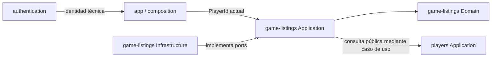

# Arquitectura de Game Listings

## Propósito y alcance

Definir el límite de dominio, los casos de uso y la persistencia conceptual de **Juegos de la comunidad** antes de implementar el vertical slice. Este documento concreta PROMPT-007B dentro del baseline de Fase 4; no implementa React, adaptadores Firebase, Storage, índices ni Security Rules.

La capability técnica se denomina `game-listings`. Su responsabilidad es publicar y gestionar anuncios simples de juegos de mesa en venta o intercambio, descubrirlos y coordinar una señal privada de interés. Las partidas continúan siendo el eje principal del producto.

## Boundary de `game-listings`

`game-listings` posee:

- el anuncio, sus datos publicables, su modalidad, condición, precio y ciclo `active` → `closed`;
- el interés privado de un Player por un anuncio y su resolución por el propietario;
- el handoff privado y voluntario de un medio de contacto del propietario a una persona aceptada;
- las reglas para crear, editar, cerrar, descubrir y consultar estos conceptos.

No posee:

- credenciales o sesiones de Authentication;
- el perfil o la reputación de `players`;
- partidas de `game-sessions`;
- un catálogo global de juegos;
- pagos, reservas, negociación, logística, envíos o transacciones;
- chat, notificaciones, suscripciones, promociones o reglas comerciales;
- moderación general de la plataforma.

El nombre visible «Juegos de la comunidad» pertenece a Presentation. `marketplace` puede nombrar la iniciativa, pero no será un contenedor técnico genérico.

## Modelo de dominio

### `GameListing`

| Campo | Representación recomendada | Criterio |
|---|---|---|
| `id` | `GameListingId`, alias opaco de `string` | Evita mezclar identificadores sin crear una clase. |
| `ownerId` | `PlayerId` compartido | Referencia al propietario; no incorpora `Player`. |
| `gameName` | `string` validado y sin espacios extremos | No existe catálogo global aprobado. |
| `imageUrl` | `string` validado | Una URL es agnóstica de Firebase y basta para una imagen. |
| `description` | `string` validado | Contiene estado relevante y preferencias de intercambio en el MVP. |
| `condition` | unión cerrada `new | likeNew | good | used` | Estable para persistencia y futura consulta. |
| `listingType` | unión cerrada `sale | trade` | Permite discriminar la regla de precio. |
| `price` | `Money` solo en `sale`; ausente en `trade` | El tipo discrimina la presencia del precio. |
| `city` | `string` validado | Madrid es la política actual, no una constante estructural del dominio. |
| `district` | `string` validado | Granularidad pública aproximada. |
| `status` | unión cerrada `active | closed` | Ciclo mínimo aprobado. |
| `createdAt` | instante ISO-8601 interno | Inmutable y sin tipos `Timestamp` fuera de Infrastructure. |

`Money` es el único value object compuesto necesario: cantidad entera positiva en céntimos y moneda fija `EUR` en el piloto. Evita decimales ambiguos sin introducir conversión, precios múltiples ni un subsistema monetario.

La modalidad se representa como una unión discriminada conceptual:

- venta: `listingType = sale` y `price` obligatorio;
- intercambio: `listingType = trade` y `price` ausente.

Los demás textos permanecen como primitivas validadas. No se crean clases para condición, localización, descripción o URL. Domain recibe el tiempo y el identificador como dependencias explícitas al crear; no conoce el reloj, el navegador ni Firestore.

### Condición

La representación persistida será:

| Valor | Etiqueta de producto |
|---|---|
| `new` | Precintado |
| `likeNew` | Como nuevo |
| `good` | Buen estado |
| `used` | Usado / con señales |

La descripción explica piezas ausentes, defectos y matices. No se añaden grados numéricos ni una taxonomía por componentes.

### Imagen

Se recomienda `imageUrl` para el primer incremento. Es una referencia web sencilla y no expone `StorageReference`, rutas de buckets, metadatos ni tipos Firebase. Application recibe una URL ya disponible y Domain solo valida que exista y tenga un formato admitido.

La obtención o subida de esa URL es un efecto externo todavía no diseñado. Si en el futuro se necesitan URLs temporales, varias imágenes o tratamiento privado, Infrastructure podrá introducir una referencia de asset y un resolver detrás de un port específico. No se crea esa abstracción antes de necesitarla.

## Invariantes de `GameListing`

- El propietario debe existir como `PlayerId` y no puede cambiar tras la creación.
- Los campos requeridos deben contener valores no vacíos y cumplir límites razonables definidos conjuntamente por Application y futuras Rules.
- Un anuncio de venta requiere un precio positivo en céntimos y moneda `EUR` durante el piloto.
- Un anuncio de intercambio no contiene precio.
- La ciudad admitida por el flujo actual es Madrid; el modelo conserva `city` para no bloquear multi-ciudad.
- Solo un anuncio `active` puede editarse, descubrirse o recibir intereses nuevos.
- El único cambio de estado es `active` → `closed`; `closed` es terminal en este MVP.
- Cerrar no equivale a vender, intercambiar o reservar, y no altera automáticamente intereses ya aceptados.
- No existe hard-delete en el flujo normal.
- `id`, `ownerId` y `createdAt` son inmutables.
- Editar no crea una nueva publicación ni reinicia su historial de intereses.

Las longitudes exactas de texto, el formato de URL permitido y los límites máximos de precio deben fijarse antes de 007E para que Domain, formulario y Rules compartan el mismo criterio de producto.

## `ListingInterest`

`ListingInterest` es un concepto separado del anuncio:

| Campo | Representación |
|---|---|
| `listingId` | `GameListingId` |
| `playerId` | `PlayerId` de la persona interesada |
| `status` | `pending | accepted | declined` |
| `createdAt` | instante ISO-8601 interno |

La pareja `listingId + playerId` es su identidad natural. En el MVP existe como máximo un interés por esa pareja; no se permite volver a expresarlo tras una resolución sin una decisión de producto nueva.

Reglas:

- el propietario no puede interesarse por su propio anuncio;
- el anuncio debe estar `active` al crear el interés;
- la creación siempre comienza en `pending`;
- solo el propietario del anuncio puede resolver `pending` a `accepted` o `declined`;
- `accepted` y `declined` son terminales;
- la persona interesada puede consultar su relación, pero no resolverla ni alterarla;
- aceptar no reserva, no cierra el anuncio y no acredita una operación;
- cerrar el anuncio hace que cualquier interés `pending` deje de ser accionable. El estado efectivo se deriva junto al `ListingStatus`, evitando un estado y una escritura masiva adicionales; Presentation debe comunicar «anuncio cerrado», no una decisión personal del propietario.

## Handoff privado de contacto

### Alternativas valoradas

1. **Contacto dentro de `GameListing`.** Es sencillo de escribir, pero una lectura autorizada del anuncio expone el documento completo. Las Rules de Firestore no ocultan campos y el riesgo de publicación accidental es alto. Se descarta.
2. **Datos separados y restringidos por interés aceptado.** Añade una lectura pequeña, pero permite autorización específica, minimiza exposición y se puede retirar cuando exista chat. Es la opción recomendada.
3. **Reutilizar email de Authentication o alojar contacto en `Player`.** Mezcla identidad técnica o perfil con una divulgación contextual y voluntaria. Se descarta.

### Decisión

Se introduce conceptualmente `ListingContactHandoff`, dentro del boundary `game-listings` pero separado del documento público:

- `listingId`;
- `interestedPlayerId`;
- `sharedByOwnerId`;
- `method`: `email | phone | other`;
- `value`: dato aportado voluntariamente por el propietario;
- `createdAt`.

Solo puede existir para un interés `accepted`. Solo el propietario puede crearlo o reemplazarlo y solo el propietario y esa persona aceptada pueden leerlo. Nunca se rellena desde Firebase Auth ni se muestra en el anuncio o perfil. El mecanismo no constituye chat y el interesado dispone de un punto de contacto unidireccional para continuar fuera de Mesa Abierta.

La retención, revocación, cifrado adicional, límites por método y medidas antiabuso deben decidirse antes de una prueba pública. Mantener el dato separado permite eliminar esta capacidad y sustituirla por chat sin migrar el documento público.

## Casos de uso de Application

### Anuncios

- `createGameListing`: valida entrada, identidad de Player, modalidad/precio y crea un anuncio activo.
- `discoverGameListings`: obtiene anuncios activos recientes para ciudad, modalidad y paginación opcional.
- `getGameListing`: recupera el detalle aplicando la audiencia permitida.
- `getMyGameListings`: obtiene activos y cerrados del propietario actual.
- `updateGameListing`: valida propiedad e invariantes y actualiza campos editables de un anuncio activo.
- `closeGameListing`: realiza la transición terminal sin borrar historial.

### Intereses y contacto

- `expressListingInterest`: crea una señal pendiente única para el Player actual.
- `getMyListingInterest`: consulta el interés del Player actual para un anuncio.
- `getListingInterestsForOwner`: lista los intereses de un anuncio después de comprobar propiedad.
- `acceptListingInterest`: resuelve un interés pendiente como aceptado.
- `declineListingInterest`: resuelve un interés pendiente como declinado.
- `shareContactForAcceptedInterest`: guarda voluntariamente el medio de contacto del propietario para una relación aceptada.
- `getAcceptedListingContact`: obtiene el handoff solo para una de sus dos partes autorizadas.

No se crean CRUD genéricos, casos de uso de reserva, compra, pago, negociación, eliminación, reapertura o mensajería.

## Ports de Application

### `GameListingRepository`

Contrato mínimo orientado a intenciones:

- crear un anuncio;
- obtenerlo por identificador;
- descubrir activos con criterios y cursor;
- obtener anuncios por propietario;
- actualizar un anuncio activo después de revalidar su estado persistido;
- cerrar un anuncio sin borrarlo.

### `ListingInterestRepository`

- crear un interés pendiente único;
- obtener el interés de una pareja anuncio/Player;
- listar intereses de un anuncio para su propietario;
- resolver un interés pendiente;
- guardar y obtener el handoff restringido de una relación aceptada.

Los ports viven en `game-listings/application` porque sus casos de uso los consumen. No devuelven snapshots, referencias, `Timestamp`, códigos Firebase ni DTOs de Firestore. Los adaptadores podrán ser factories de funciones; no se prescriben clases.

La resolución de intereses y la creación del contacto deben revalidar en una operación consistente el anuncio, la propiedad y el estado de la relación. Application traduce conflictos esperables a resultados propios; Infrastructure traduce fallos del proveedor.

## Ownership y dependencias



- `PlayerId` es la primitiva transversal mínima ya aceptada en `shared/domain`.
- `ownerId` identifica al propietario y `playerId` a quien expresa interés.
- Authentication entrega una identidad técnica; `app` y los casos de uso resuelven el `PlayerId`. Domain no importa Auth ni asume un `Firebase User`.
- Para mostrar propietario o interesado, Presentation compone las lecturas públicas de `players` mediante sus casos de uso; `GameListing` no incorpora un perfil.
- `game-listings` no importa ni consulta `game-sessions`. `gameName` es texto del anuncio, no una entidad compartida ni un catálogo global.

## Persistencia conceptual en Firestore

### Estructura recomendada

```text
gameListings/{listingId}
├── interests/{playerId}
└── contactHandoffs/{playerId}
```

El documento de anuncio contiene únicamente su representación publicable. El identificador del documento se mapea a `GameListing.id`; `createdAt` se persiste como `Timestamp` y se convierte al instante interno en Infrastructure. `price` se persiste como cantidad en céntimos y moneda, y queda ausente para intercambio.

El documento de interés usa `playerId` como identificador de documento y conserva también los campos de dominio necesarios. Esto hace idempotente la unicidad por anuncio/Player. El handoff usa el mismo identificador y permanece en una subcolección distinta para aplicar reglas y lecturas más restrictivas.

### Comparación

| Alternativa | Ventajas | Costes / riesgos |
|---|---|---|
| `listingInterests/{listingId}_{playerId}` global | Facilita consultar relaciones de muchos anuncios con una colección única. | Expone un espacio global más amplio, repite ownership y exige filtros estrictos para cada lectura; contacto seguiría necesitando otra unidad restringida. |
| `gameListings/{listingId}/interests/{playerId}` | La ruta expresa pertenencia, evita duplicados, simplifica consultar y autorizar intereses de un anuncio. | Consultas transversales futuras requieren `collectionGroup` e índice. |
| Intereses embebidos en el anuncio | Una lectura inicial. | Crecimiento no acotado, escrituras contendidas y privacidad deficiente. Se descarta. |

Se eligen subcolecciones porque las consultas actuales son por anuncio o por pareja conocida, y porque su ownership y audiencia son claros. La inexistencia de hard-delete evita subcolecciones huérfanas. Si en el futuro «Mis intereses» requiere un listado transversal, se usará `collectionGroup` sobre `interests` filtrado por `playerId`; no se duplica ahora una segunda fuente de verdad.

## Queries e índices previsibles

| Flujo | Consulta conceptual | Índice previsible |
|---|---|---|
| Bloque de Explorar | `status = active`, `city`, orden `createdAt desc`, límite pequeño | compuesto `status + city + createdAt desc` |
| Ver todos | igual, con cursor de paginación | el mismo índice |
| Filtrar por modalidad | activos por ciudad y `listingType`, recientes | `status + city + listingType + createdAt desc` |
| Filtrar por zona, si se activa | activos por ciudad y `district`, recientes | `status + city + district + createdAt desc` |
| Mis anuncios | `ownerId`, orden `createdAt desc` | `ownerId + createdAt desc` |
| Detalle | ruta por `listingId` | ninguno compuesto |
| Mi interés | ruta `listingId/playerId` | ninguno compuesto |
| Intereses del anuncio | subcolección del anuncio, orden `createdAt desc` | índices automáticos de campo; compuesto solo si se filtra también por estado |

No se crea una combinación para cada filtro posible. 007C debe introducir únicamente los índices que exijan las consultas realmente implementadas y registrar los enlaces de error del Emulator cuando correspondan. La búsqueda parcial por nombre no se resuelve eficientemente con Firestore; para el volumen inicial puede filtrarse sobre una página acotada o utilizar un campo normalizado si el caso de uso lo exige. Un motor de búsqueda queda fuera.

## Security boundaries para 007E

### Anuncios

- denegar por defecto y exigir autenticación;
- permitir descubrir y leer anuncios `active` a personas autenticadas;
- permitir leer un anuncio `closed` solo al propietario y a personas con una relación previa cuando el historial lo requiera;
- crear únicamente con `ownerId` igual al `PlayerId` vinculado a la identidad autenticada, `status = active` y forma válida;
- actualizar o cerrar solo por el propietario;
- mantener inmutables `ownerId` y `createdAt` y una lista cerrada de campos;
- validar modalidad/precio y la transición `active` → `closed`;
- denegar reapertura y delete físico.

### Intereses

- crear únicamente en el documento propio, con identidad coincidente y estado `pending`;
- exigir anuncio `active` y propietario distinto del interesado;
- impedir duplicados mediante la ruta estable;
- leer solo por la persona interesada o el propietario del anuncio;
- permitir resolver solo al propietario y exclusivamente `pending` → `accepted | declined`;
- mantener inmutables anuncio, interesado y fecha;
- denegar autoaceptación, modificaciones por terceros y delete desde el cliente;
- denegar nuevos intereses o resoluciones cuando el anuncio esté cerrado.

### Handoff de contacto

- crear o reemplazar solo por el propietario del anuncio para un interés `accepted`;
- exigir que `sharedByOwnerId` e `interestedPlayerId` coincidan con anuncio, ruta e interés;
- leer únicamente por esas dos identidades;
- denegar listado amplio y acceso de cualquier otra persona;
- validar una lista cerrada de campos y límites de tamaño;
- no derivar el valor de claims o email de Firebase Auth.

Las Rules no sustituyen las invariantes de Domain. Las operaciones sensibles deberán ejecutarse en batch o transacción cuando necesiten comprobar varios documentos. El modelo actual puede mantenerse client-only; no se justifica Cloud Functions para estas transiciones mientras las Rules puedan verificarlas de forma completa.

## Estructura objetivo

La implementación deberá crecer solo con carpetas que contengan responsabilidad real:

```text
src/game-listings/
├── domain/
│   ├── game-listing
│   ├── listing-interest
│   └── listing-contact-handoff
├── application/
│   ├── ports
│   ├── listing-use-cases
│   └── interest-use-cases
├── infrastructure/
│   ├── firestore-game-listing-repository
│   └── firestore-listing-interest-repository
└── presentation/
    ├── pages
    ├── components
    └── hooks
```

Los nombres muestran agrupaciones conceptuales, no obligan a un archivo por caso de uso ni a repetir carpetas vacías.

- **007C:** implementar Domain, Application, ports y adaptadores Firestore mínimos, conversiones, operaciones consistentes y pruebas de dominio/integración contra Emulator. La imagen seguirá una decisión de infraestructura expresamente aprobada; este documento no autoriza Storage.
- **007D:** integrar Presentation, rutas y estados UX aprobados consumiendo los casos de uso. No accederá a Firebase desde React.
- **007E:** concretar Security Rules e índices para el esquema realmente implementado y cubrir ALLOW/DENY, privacidad del contacto y ownership.

## Future-proofing limitado

- **Alquiler:** podrá añadir una modalidad y un ciclo propio tras una decisión de producto; no se anticipan depósitos, fechas o penalizaciones.
- **Preferencias de intercambio:** podrán convertirse en un valor estructurado o relación cuando buscar y emparejar lo justifique; ahora viven en descripción.
- **Varias imágenes:** podrán sustituir la única URL por una colección ordenada o referencias de asset; no se añade una lista vacía hoy.
- **Favoritos:** serían una relación privada por Player, separada del anuncio y de los intereses.
- **Chat:** sería una capability de comunicación autorizada por una relación aceptada; reemplazaría el handoff sin cambiar el anuncio público.
- **Tiendas:** requerirán identidad, roles y ownership propios; el MVP mantiene propietarios `Player` y no añade `ownerType` especulativo.
- **Destacados y monetización:** ranking y entitlements pertenecerán a capacidades separadas; no se añaden flags o planes al anuncio.
- **Multi-ciudad:** `city` y `district` permiten ampliar consultas y políticas; Madrid se valida en el flujo actual.
- **Otras monedas:** `Money` hace explícito EUR y admite ampliar la unión tras una decisión regional; no existe selector de moneda.

## Decisiones y riesgos abiertos

- mecanismo de obtención/subida de `imageUrl`, derechos sobre imágenes, moderación y límites de archivo;
- longitudes y límites exactos que deberán coincidir entre Domain, UI y Rules;
- retención, revocación y protección operativa del dato de contacto;
- si una persona puede volver a expresar interés tras ser declinada;
- cuántos intereses puede aceptar un propietario y cómo se explica que ninguno reserva;
- comportamiento de intereses pendientes al cerrar en términos de historial y copy, aunque dejen de ser accionables;
- qué audiencia exacta conserva acceso al detalle de un anuncio cerrado;
- búsqueda por texto si el volumen supera el filtrado acotado inicial;
- controles mínimos de contenido, denuncia y artículos permitidos antes de una prueba pública;
- migración futura de ownership si se aprueban tiendas o perfiles comerciales;
- estrategia de caché, escucha en tiempo real y paginación una vez existan consultas reales.

Estas cuestiones no bloquean 007C si esa tarea conserva el alcance y deja configurables los límites todavía no decididos. Sí deben resolverse las relativas a contenido, contacto y privacidad antes de exponer anuncios reales a usuarios externos.
