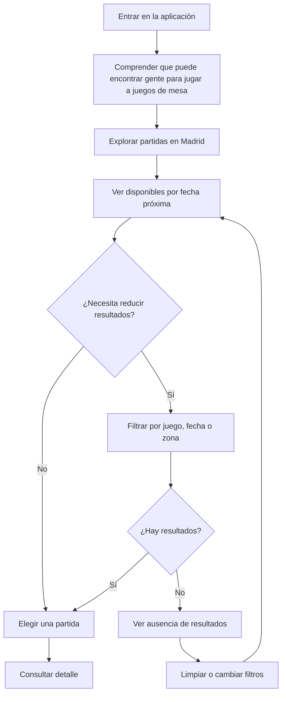
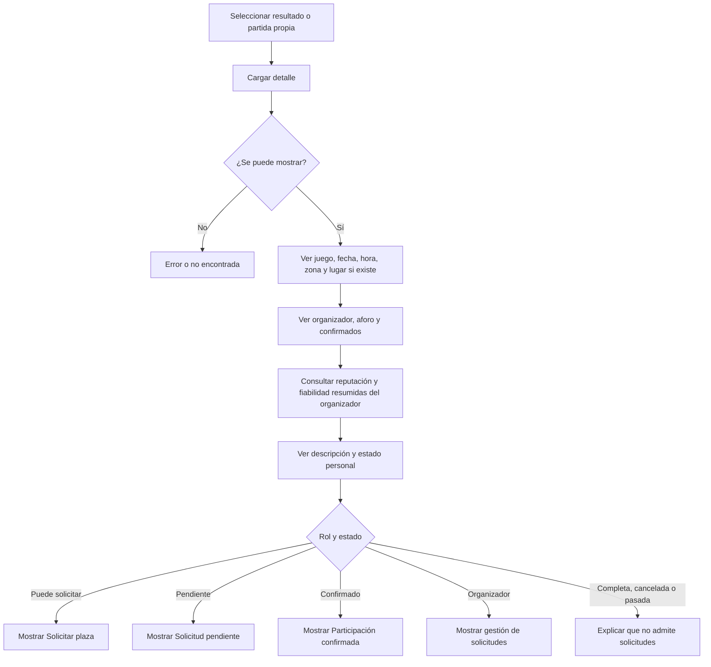
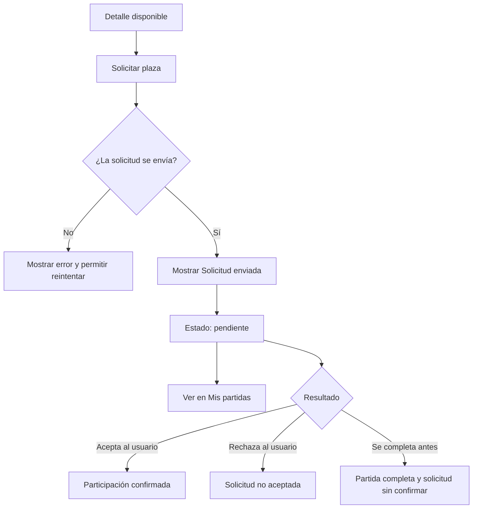
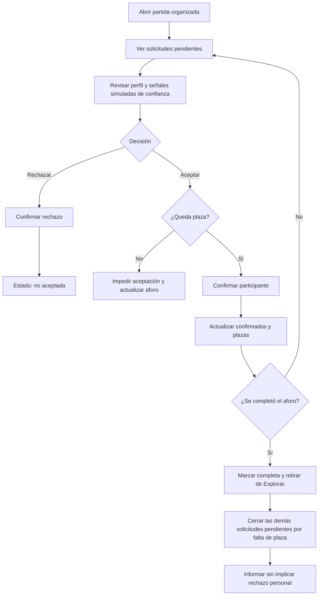
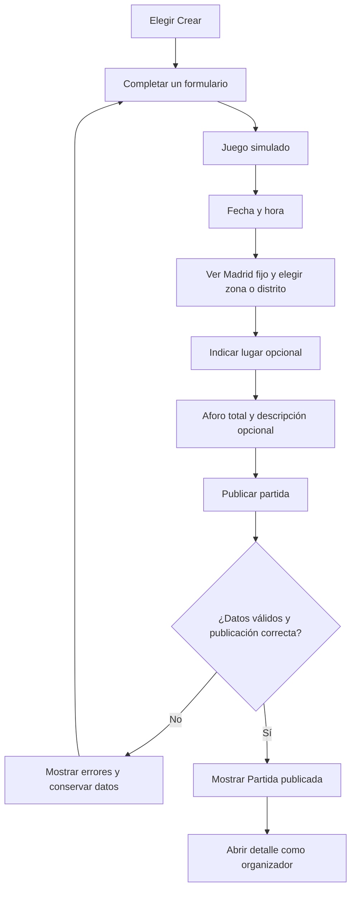
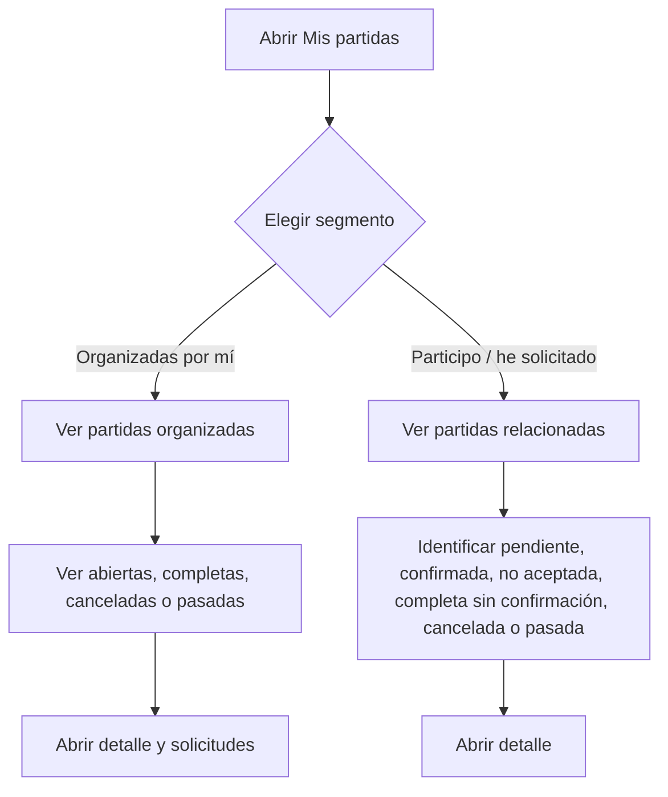
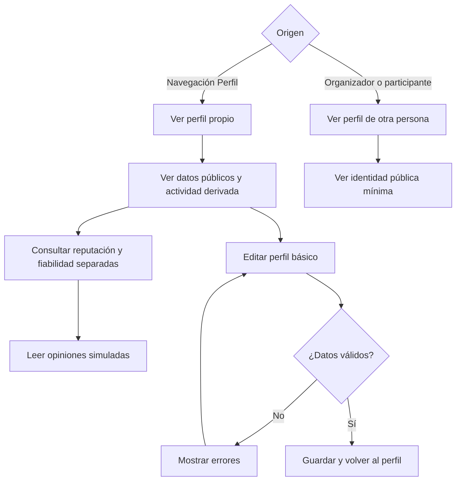
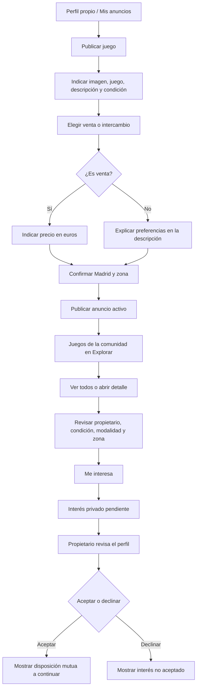
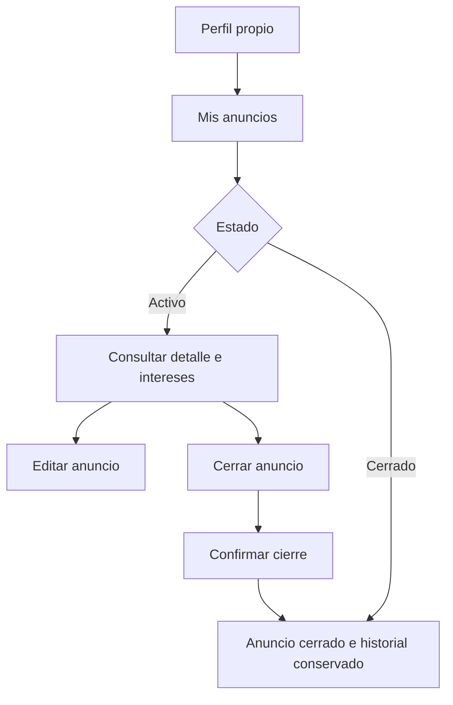

# Core User Flows — Fase 1

## Convenciones

- Madrid es el contexto geográfico fijo y preseleccionado del prototipo. No existe selector de ciudad; esto no limita una futura ampliación multi-ciudad.
- «Disponible» significa futura, no cancelada y con plazas confirmadas libres.
- El organizador cuenta dentro del aforo.
- Una solicitud pendiente no es participación confirmada y no ocupa una plaza confirmada.
- Las acciones personales presuponen una identidad simulada en UX/prototipo; no se diseña autenticación.

Los flujos 01–07 conservan las decisiones aprobadas de Fase 1. Los flujos 08–09 son la definición conceptual añadida por PROMPT-007A para el Marketplace MVP y presuponen la identidad real ya existente al comenzar Fase 6; todavía no describen implementación ni arquitectura.

## FLOW-01 — Descubrir partidas

**Objetivo:** encontrar partidas potencialmente interesantes con la menor fricción.

**Entrada:** apertura de la aplicación o destino Explorar.

**Flujo principal:**

**Información de cada resultado:** juego, fecha/hora, zona y Madrid, organizador, confirmados/aforo, plazas disponibles y «Ver partida».

**Alternativas:**

- Sin ninguna partida disponible: explicar el vacío y ofrecer «Crear partida».
- Sin coincidencias para filtros: conservar filtros visibles y ofrecer «Limpiar filtros».
- Error de carga: conservar contexto y ofrecer «Reintentar».
- Loading: reservar la jerarquía del listado sin presentar datos ficticios como reales.

**Resultado:** el usuario llega al detalle de una partida o entiende cómo ampliar/crear opciones.

## FLOW-02 — Consultar detalle de una partida

**Objetivo:** decidir si solicitar plaza con información suficiente y no excesiva.

**Contenido:** juego, fecha, hora, Madrid y zona/distrito, lugar simulado si existe, nombre del organizador, resumen separado de su reputación y fiabilidad simuladas, aforo total, plazas confirmadas y disponibles, participantes confirmados, descripción opcional y estado del usuario. Las opiniones completas se consultan en el perfil para mantener el foco del detalle.

El lugar se representa como nombre de local o punto reconocible, sin exigir dirección postal. La visibilidad futura de un punto exacto real no se diseña en esta fase. Una solicitud pendiente tampoco aparece dentro de participantes confirmados.

## FLOW-03 — Solicitar participar

**Objetivo:** enviar una solicitud entendiendo que todavía no existe una plaza confirmada.

**Precondición:** usuario identificado, no organizador, sin solicitud previa y partida disponible.

**Reglas UX:**

- Mensaje de éxito: «Solicitud enviada. Está pendiente de respuesta; aún no tienes una plaza confirmada».
- No se permite duplicar una solicitud.
- Ya confirmado: mostrar el estado, no la acción.
- Completa: «No quedan plazas disponibles».
- Si la partida se completa mientras la solicitud está pendiente: «La partida se ha completado. Tu solicitud no llegó a confirmarse porque ya no quedan plazas».
- Cancelada: «La partida ha sido cancelada».
- Pasada: «Esta partida ya se celebró».
- Si cambia la disponibilidad durante el envío, explicar el cambio y actualizar el detalle.

## FLOW-04 — Gestionar solicitudes como organizador

**Objetivo:** aceptar o rechazar solicitudes sin superar el aforo.

**Entrada:** Mis partidas → Organizadas por mí → detalle, o acceso directo a una partida propia.

**Reglas UX:**

- Una fila pendiente muestra nombre, avatar opcional, zona general, descripción breve y acciones.
- Aceptar vuelve a comprobar capacidad; al confirmarse, mueve a la persona a participantes confirmados.
- Rechazar requiere confirmación breve y no exige motivo.
- Si la partida queda completa, las demás solicitudes dejan de estar pendientes porque ya no pueden obtener plaza y no existe lista de espera.
- Esas personas ven: «La partida se ha completado. Tu solicitud no llegó a confirmarse porque ya no quedan plazas». No se comunica como rechazo personal del organizador.
- No se decide todavía el nombre técnico del resultado ni su modelo de datos.
- Las señales del perfil ayudan a contextualizar la decisión, pero no automatizan, recomiendan ni bloquean aceptar o rechazar. No hay scoring de aceptación.

## FLOW-05 — Crear una partida

**Objetivo:** publicar una partida con un único formulario corto.

**Decisión de pantalla:** un solo formulario. Madrid se muestra como contexto fijo, no como campo editable; el usuario elige zona o distrito y puede indicar por separado un lugar reconocible. El lugar es opcional en el prototipo, no sustituye la descripción y no exige una dirección particular.

**Validaciones UX mínimas:** campos obligatorios identificados, fecha/hora futura y aforo total comprensible. Ayuda de aforo: «Tú cuentas dentro del aforo; con 4 habrá 3 plazas disponibles».

No incluye selector de ciudad, multi-ciudad, recurrencia, torneo, lista de espera, votación, múltiples juegos, mapa, geolocalización, precio o pago. La ampliación futura a otras ciudades continúa siendo posible.

## FLOW-06 — Mis partidas

**Objetivo:** distinguir lo organizado de las solicitudes y participaciones propias.

**Reglas UX:**

- Los dos segmentos mantienen recuentos solo si ayudan y los datos son fiables.
- Cada tarjeta muestra la relación del usuario y el estado en texto.
- «Organizada» describe la relación del usuario; abierta/completa/cancelada/pasada describe la partida.
- Vacío en Organizadas: «Aún no has organizado partidas» + «Crear partida».
- Vacío en Participación: «Aún no has solicitado participar» + «Explorar partidas».

## FLOW-07 — Perfil básico

**Objetivo:** comprender quién es otra persona o revisar la propia identidad visible sin funciones de red social.

**Perfil propio:** nombre visible, avatar opcional, ciudad, zona/distrito opcional, descripción opcional, actividad derivada útil, reputación simulada, fiabilidad simulada y «Editar perfil».

**Perfil ajeno:** información pública equivalente, con reputación subjetiva, fiabilidad observable o derivada, aspectos destacados y opiniones recientes. No tiene seguir, añadir amistad, puntuar, contactar ni ver datos privados.

Las opiniones son solo lectura. Conceptualmente proceden de personas que compartieron una partida ya finalizada y estuvieron confirmadas; el flujo de publicación no se implementa todavía.

La composición sigue siendo una hipótesis UX y no prescribe modelo de datos.

## FLOW-08 — Publicar, descubrir e indicar interés por un juego

**Objetivo:** conectar a una persona que ofrece un juego con otra interesada, sin convertir la experiencia en ecommerce ni exponer contacto privado.

**Reglas de producto:**

- Las partidas aparecen antes que Marketplace en Explorar.
- Solo anuncios `active` aparecen en descubrimiento; los cerrados conservan historial y no se eliminan físicamente.
- Una persona no puede expresar interés por su propio anuncio ni duplicar su señal activa.
- «Me interesa» no reserva el juego, no completa una compra y no revela email o teléfono.
- Aceptar un interés no cierra automáticamente el anuncio; el propietario lo cierra cuando deja de estar disponible.
- Si el anuncio se cierra, los intereses pendientes dejan de presentarse como accionables y se explica que ya no está disponible.
- No existen chat, pagos, negociación, envíos ni alquiler.

## FLOW-09 — Gestionar Mis anuncios

**Objetivo:** permitir al propietario mantener sus publicaciones sin añadir una sección permanente a la navegación principal.

El cierre sustituye al hard-delete. `reserved`, reapertura, eliminación física y gestión comercial por lotes quedan fuera del MVP.
